# EDD：Portable OLAP Lakehouse（Local K8s / Prod AWS）工程設計規格書

> 文件版本：v1.0  
> 日期：2026-05-12  
> 目標讀者：Data Engineer、Platform Engineer、Analytics Engineer、SRE、BI Owner  
> 狀態：可落地實作版  
> 核心決策：採用 **Contract-first Portable Lakehouse**。Local 使用 Rancher Desktop + MinIO + Polaris + Trino；Prod 使用 S3 + Iceberg + Glue Catalog + Athena。兩者不是 100% 同形，而是透過「平台轉換層」把差異自動化、可測試化、可回滾化。

---

## 0. Executive Summary

本文件定義一套可落地的 OLAP Lakehouse 架構，滿足以下目標：

1. 線上 OLTP / OLAP 嚴格分離。
2. Local 可用 Rancher Desktop / Kubernetes 離線開發。
3. Local 與 Prod 雖採不同查詢平台，但透過程式化轉換層維持一致的開發、測試、部署與治理流程。
4. Bronze / Silver / Gold 三層資料轉換明確可追蹤。
5. Gold 層採 Star Schema，dimension FK 使用 BIGINT hash，date 推薦 DATE 型別，hour 粒度 INT 0-23，TIMESTAMP/VARCHAR 禁止出現在 serving fact。
6. 支援 `hour -> day -> month` 三段彙總表。
7. 支援 `date, time, field, value` 型態的 hour narrow fact，再透過 pivot 反轉成 hour/day/month wide fact/cache table。
8. USER 端透過 MV 或 MV-equivalent cache table 提供低延遲查詢。
9. 以 S3 dual-location 設計異地備援與 DR failover。

最終定位：

```text
不是 full isomorphic lakehouse，
而是 contract-first portable lakehouse with automated platform adapters。
```

Local stack：

```text
Rancher Desktop + MinIO + Iceberg + Apache Polaris + Trino + dbt-trino + Airflow + Metabase -> Trino
```

Prod stack：

```text
S3 + Iceberg + AWS Glue Data Catalog + Athena + dbt-athena + Airflow/MWAA + Metabase -> Athena
```

核心原則：

```text
Git contracts / dbt project / platform adapters 是 source of truth。
Local Polaris catalog 不是 source of truth。
Prod Glue catalog 也不是 source of truth。
```

---

## 1. 背景與第一性原則

### 1.1 為什麼要 OLTP / OLAP 分離

OLTP 系統服務線上交易，追求低延遲、高一致性、短交易、row-level read/write。OLAP 系統服務分析、報表、聚合、長查詢、大表掃描，追求高吞吐與 columnar scan。兩者混用會造成：

| 問題 | 後果 |
|---|---|
| 報表掃大表 | OLTP P95/P99 latency 上升 |
| 分析索引污染交易表 | schema / index 設計被分析需求綁架 |
| 報表 join / window function 在 OLTP 執行 | lock、CPU、IO 競爭 |
| 無 Bronze/Silver/Gold 分層 | raw data、clean data、business metric 混亂 |
| 無可回溯快照 | 報表錯誤難以定位 |

因此 OLTP 只做交易事實與狀態維護；OLAP 透過 CDC / batch ingest 從 OLTP 複製資料，落到 S3 / Iceberg，再供 dbt、Athena、Trino、Metabase 查詢。

### 1.2 為什麼不是 full isomorphic

Local 使用 Polaris + Trino；Prod 使用 Glue + Athena。這代表下列層面不同：

| 層 | Local | Prod | 風險 |
|---|---|---|---|
| Catalog | Polaris REST Catalog | Glue Data Catalog | metadata representation / permissions 不同 |
| Query engine | Trino | Athena | SQL dialect / function / DDL 不同 |
| dbt adapter | dbt-trino | dbt-athena | materialization config 不同 |
| BI driver | Metabase Trino/Starburst | Metabase Athena | SQL 與 connection options 不同 |
| Maintenance | Trino procedures | Athena OPTIMIZE/VACUUM 或 Glue/Spark job | command 不同 |

所以策略不是假裝完全一致，而是建立「受控差異層」。

### 1.3 設計目標

| 目標 | 驗收標準 |
|---|---|
| Local 可完整跑通 lakehouse dev loop | `dbt build --target local-trino` 可在 Rancher Desktop 完成 Bronze->Silver->Gold->Cache |
| Prod 可從同一份 dbt project 部署 | `dbt compile --target prod-athena` 必須通過；prod execution 由 MWAA/Airflow 執行 |
| Catalog 差異程式化 | `catalog_promote.py` 可將 canonical table contract 對應到 Glue registration/crawler |
| SQL 差異程式化 | 所有差異只出現在 `macros/platform/*`，model SQL 不得出現 `target.type` |
| Gold fact 型別規範 | entity/field SK 必須 BIGINT hash；date_sk 推薦 DATE 型別；hour 粒度用 INT 0-23；TIMESTAMP/VARCHAR 禁止出現在 serving fact |
| hour/day/month pipeline 可重跑 | 任一時間範圍可透過 Airflow backfill 重算 |
| USER cache 可管控 | cache freshness 可監控；cache 表可重建；Metabase 僅查 cache/gold |
| DR 可操作 | 有明確 RPO/RTO、failover/failback runbook |

### 1.4 非目標

1. 不追求 Local 與 Prod catalog 100% 同一軟體。
2. 不做任意 SQL 自動轉譯器。
3. 不允許 BI dashboard 寫任意 engine-specific SQL。
4. 不允許手動在 Polaris UI 或 Glue UI 建立正式表作為 source of truth。
5. 不保證 hash surrogate key 零碰撞；必須以 collision detection 管控。

---

### 1.5 理論基礎與業界實踐

本架構的設計決策有明確的學術理論與業界實踐支撐，非發明新輪子。

#### Lambda Architecture

> Nathan Marz & James Warren, *Big Data: Principles and Best Practices of Scalable Real-Time Data Systems*, Manning Publications, 2015.

Lambda Architecture 將系統分為三層：Batch Layer（全量主資料集，定期重算）、Speed Layer（近期增量，低延遲）、Serving Layer（合併兩層，回應查詢）。本架構對應：

| Lambda 層 | 本架構角色 |
|-----------|-----------|
| Batch Layer | Athena Iceberg（全量歷史，Airflow 定期重算） |
| Batch Layer（增量優化） | dbt incremental（每日/每小時 lookback 更新；本架構簡化版，無獨立 streaming Speed Layer） |
| Serving Layer | MySQL OLAP Cache（Hot Tier，直接服務 BI 查詢） |

#### CQRS + Materialized View Pattern

> Martin Fowler, "CQRS", martinfowler.com, 2011. / Microsoft Azure Architecture Center, "CQRS Pattern".
> 實際案例：Airbnb Riverbed — 分散式 Materialized View 框架，每日處理 24 億事件。(InfoQ, 2023)

CQRS（Command Query Responsibility Segregation）將寫入模型與讀取模型完全分離。Materialized View 是讀取端標準實作：預先計算扁平化查詢結構，消除複雜 JOIN。

本架構的 **MySQL Gold Cache 表即為 Materialized View**：寫入端（dbt + Airflow）計算完成後寫入；MySQL 本身不承擔計算責任，只提供低延遲讀取服務。

#### Hot-Warm-Cold Data Tiering

> Elastic, "Elasticsearch data tiers: hot, warm, cold, and frozen storage explained". / AWS Big Data Blog, "Amazon OpenSearch Service storage tiers".

資料溫度分層是時序資料管理的業界標準：Hot Tier 存放最近期高頻查詢資料（NVMe/SSD，毫秒延遲）；Cold Tier 存放歷史資料（S3 成本，按需查詢）。

| 溫度層 | 本架構角色 | 存取延遲 | 成本 |
|--------|-----------|---------|------|
| Hot | MySQL OLAP Cache（近 730 天） | < 50ms | 中（RDS 固定費） |
| Cold | Athena Iceberg on S3（全量歷史） | 1-30s | 低（S3 + 按查詢計費） |

#### Data Lifecycle Management / TTL Rotation

> AWS, "Managing the lifecycle of objects", Amazon S3 User Guide. / Airbnb Engineering, "How Airbnb achieved metric consistency at scale" (Minerva 平台自動 deprecation policy).

資料生命週期管理透過 Transition Actions（轉移）與 Expiration Actions（過期刪除）自動化資料輪轉。本架構的 MySQL Partition Rotation 是 DLM 原則在關聯式資料庫的直接應用。

#### Medallion Architecture（Bronze / Silver / Gold）

> Databricks, "What is Medallion Architecture?", Databricks Blog. / Microsoft Azure Databricks Docs, "What is the medallion lakehouse architecture?".

Medallion Architecture 將資料湖分為 Bronze（原始）、Silver（清洗整合）、Gold（業務聚合，最終消費）三層。本架構完整實作此分層：

| Medallion 層 | 本架構角色 |
|-------------|-----------|
| Bronze | Athena Iceberg raw tables（原始事件，append-only） |
| Silver | Athena Iceberg cleaned tables（typed + dedup + conformed） |
| Gold | Athena Iceberg Gold Wide Tables（預計算，data lake 內的最終消費層） |

> **MySQL Gold Cache 與 Medallion 分層的關係**：MySQL Gold Cache 是 Gold 層資料的 **Hot Tier physical serving store**，技術上屬於 Medallion 分層之外的 serving infrastructure（Databricks 原始定義的 Gold 層仍在 data lake 內）。MySQL Cache 對應 **Hot-Warm-Cold Tiering** 的 Hot Tier（見上節），而非 Medallion Gold 層的一部分。

---

## 2. 參考事實與產品限制

以下是本 EDD 採納的關鍵事實。實作時請以當前官方文件再次驗證。

1. Apache Iceberg table state 由 metadata files 維持；每次 table state 變更會建立新的 metadata file，並透過 atomic swap 指向新 metadata；metadata 追蹤 schema、partition config、properties 與 snapshots。[Apache Iceberg Spec](https://apache.github.io/iceberg/spec/)
2. Iceberg hidden partitioning 可用 `year/month/day/hour/bucket/truncate` 等 transform，讓查詢不需要知道實體 partition 欄位即可 pruning。[Apache Iceberg Partitioning](https://iceberg.apache.org/docs/latest/partitioning/)
3. Trino Iceberg connector 支援 Iceberg spec v1/v2，支援 REST catalog、Glue、Hive Metastore、JDBC catalog、Nessie、Snowflake catalog 等 catalog。[Trino Iceberg Connector](https://trino.io/docs/current/connector/iceberg.html)
4. Trino 可透過 Iceberg connector 管理 materialized views；MV 底層是 Iceberg storage table，需 `REFRESH MATERIALIZED VIEW` 才會填資料。[Trino Iceberg Materialized Views](https://trino.io/docs/current/connector/iceberg.html#materialized-views)
5. Athena 的 Iceberg tables 使用 AWS Glue catalog 作為 metastore；dbt-athena 亦明確針對 Athena + Glue + Iceberg materialization。[dbt-athena Iceberg](https://dbt-athena.github.io/docs/configuration/materializations/iceberg)
6. AWS Glue Crawlers 可註冊 / 更新 Iceberg tables 到 Glue Data Catalog，並更新 latest metadata file location。[AWS Glue Iceberg Crawler](https://aws.amazon.com/about-aws/whats-new/2023/07/aws-glue-crawlers-apache-iceberg-tables/)
7. Athena 可以 query Glue Data Catalog materialized views，但 Athena 不支援對這些 MV 執行 `CREATE MATERIALIZED VIEW`、`REFRESH MATERIALIZED VIEW`、`DROP`、`INSERT`、`UPDATE`、`MERGE`、`OPTIMIZE`、`VACUUM` 等操作；建立與 refresh 需由 Spark / Glue / EMR 或 Glue API 處理。[Athena Query Glue Data Catalog Materialized Views](https://docs.aws.amazon.com/athena/latest/ug/querying-iceberg-gdc-mv.html)
8. S3 Multi-Region Access Points 提供跨 region global endpoint 與 failover control，但若要保證任一 bucket 都有物件，仍需設定 S3 Cross-Region Replication。[S3 MRAP](https://docs.aws.amazon.com/AmazonS3/latest/userguide/MultiRegionAccessPoints.html), [MRAP + Replication](https://docs.aws.amazon.com/AmazonS3/latest/userguide/MultiRegionAccessPointBucketReplication.html)
9. S3 Replication Time Control 可提供大多數物件秒級複製，且 99.9% 物件 15 分鐘內完成 replication 的 SLA / visibility。[S3 RTC](https://docs.aws.amazon.com/AmazonS3/latest/userguide/replication-time-control.html)
10. Iceberg `rewrite_table_path` 可把 metadata 中的 source prefix 改寫成 target prefix，用於 table replication / DR；它只 stage rewritten metadata 與 copy plan，不負責實際 copy。[Iceberg Spark Procedure rewrite_table_path](https://iceberg.apache.org/docs/1.9.2/spark-procedures/#rewrite_table_path)
11. Amazon S3 Tables replication 可建立 read-only Iceberg table replicas，維持 data、metadata、snapshot history；本文件把它列為 Phase 2 可評估選項。[S3 Tables Replication](https://docs.aws.amazon.com/AmazonS3/latest/userguide/s3-tables-replication-how-replication-works.html)

---

## 3. 全域系統架構

### 3.1 邏輯架構

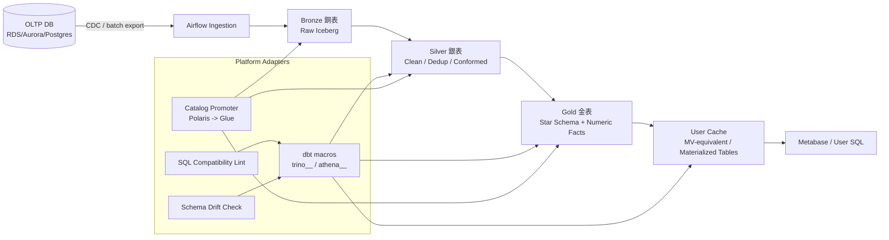

### 3.2 Local 架構

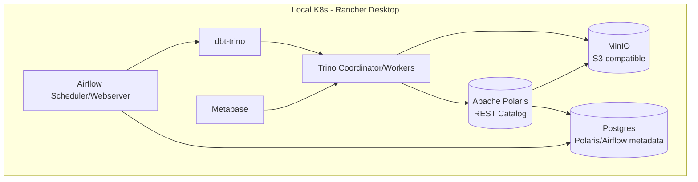

### 3.3 Prod 架構

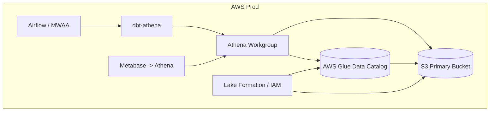

### 3.4 Portable Adapter 架構

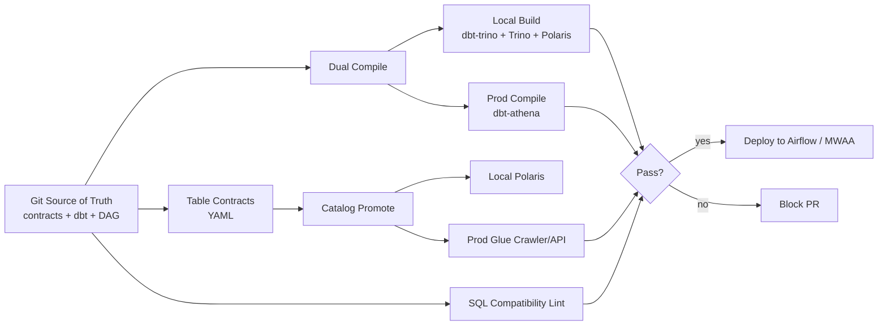

---

## 4. 環境與元件矩陣

| Layer | Local | Prod | 轉換策略 |
|---|---|---|---|
| Object storage | MinIO | S3 | S3 API-compatible；bucket/prefix 由 contract 決定 |
| Table format | Iceberg | Iceberg | 固定 Iceberg v2 + Parquet + ZSTD |
| Catalog | Polaris | Glue Catalog | `catalog_promote.py` + Glue crawler / Glue API |
| Query engine | Trino | Athena | dbt macro + SQL compatibility lint |
| dbt adapter | dbt-trino | dbt-athena | dual target + adapter.dispatch |
| Orchestration | Airflow on K8s | MWAA or Airflow on AWS | 同 DAG，不同 Connection / Variable |
| BI | Metabase -> Trino | Metabase -> Athena | dashboard SQL limited subset；prefer cache tables |
| Cache/MV | Trino MV or cache tables | dbt cache Iceberg tables; Athena read-only GDC MV optional | USER 端查 `cache.*` |
| DR | Local not required | S3 dual-location + Glue DR catalog | Airflow DR runbook |

---

## 5. Repository Layout

建議單一 repo 管理 lakehouse platform：

```text
lakehouse-platform/
├── README.md
├── edd.md
├── contracts/
│   ├── tables/
│   │   ├── bronze.orders.yml
│   │   ├── silver.orders.yml
│   │   ├── gold.dim_customer.yml
│   │   ├── gold.fact_metric_hour_long.yml
│   │   ├── gold.fact_metric_hour_wide.yml
│   │   ├── gold.fact_metric_day_wide.yml
│   │   └── gold.fact_metric_month_wide.yml
│   ├── metrics/
│   │   ├── field_registry.yml
│   │   └── namespace_registry.yml
│   ├── policies/
│   │   ├── pii.yml
│   │   └── lakeformation.yml
│   └── dashboards/
│       └── metabase.yml
├── dbt/
│   ├── dbt_project.yml
│   ├── profiles.yml.example
│   ├── macros/
│   │   ├── platform/
│   │   │   ├── stable_hash64_number.sql
│   │   │   ├── platform_table_config.sql
│   │   │   ├── pivot_metrics.sql
│   │   │   ├── date_time_keys.sql
│   │   │   └── cache_materialization.sql
│   │   └── tests/
│   ├── models/
│   │   ├── bronze/
│   │   ├── silver/
│   │   ├── gold/
│   │   └── cache/
│   ├── snapshots/
│   └── seeds/
├── airflow/
│   ├── dags/
│   │   ├── lakehouse_ingest.py
│   │   ├── lakehouse_transform.py
│   │   ├── lakehouse_cache_refresh.py
│   │   ├── lakehouse_maintenance.py
│   │   └── lakehouse_dr.py
│   └── plugins/
├── platform/
│   ├── catalog_promote.py
│   ├── validate_contracts.py
│   ├── validate_sql_compatibility.py
│   ├── validate_hash_collisions.py
│   ├── generate_pivot_models.py
│   ├── generate_glue_crawler_config.py
│   ├── rewrite_iceberg_paths.py
│   └── adapters/
│       ├── trino_polaris.py
│       ├── athena_glue.py
│       ├── metabase.py
│       └── s3_dual_location.py
├── k8s/
│   ├── local/
│   │   ├── namespaces.yaml
│   │   ├── minio-values.yaml
│   │   ├── polaris-values.yaml
│   │   ├── trino-values.yaml
│   │   ├── airflow-values.yaml
│   │   └── metabase-values.yaml
│   └── prod/
│       ├── mwaa/
│       ├── glue/
│       ├── athena/
│       └── s3/
└── ci/
    ├── pr.yml
    ├── deploy-prod.yml
    └── nightly.yml
```

---

## 6. Data Lake Layout

### 6.1 Namespace

必須固定四個主要 namespace：

```text
bronze
silver
gold
cache
```

選用 namespace：

```text
audit
ops
sandbox
```

### 6.2 S3 / MinIO prefix layout

Local MinIO：

```text
s3://lakehouse-local/warehouse/bronze/...
s3://lakehouse-local/warehouse/silver/...
s3://lakehouse-local/warehouse/gold/...
s3://lakehouse-local/warehouse/cache/...
```

Prod S3 primary：

```text
s3://company-lakehouse-prod-usw2/warehouse/bronze/...
s3://company-lakehouse-prod-usw2/warehouse/silver/...
s3://company-lakehouse-prod-usw2/warehouse/gold/...
s3://company-lakehouse-prod-usw2/warehouse/cache/...
```

Prod S3 DR：

```text
s3://company-lakehouse-prod-use1-dr/warehouse/bronze/...
s3://company-lakehouse-prod-use1-dr/warehouse/silver/...
s3://company-lakehouse-prod-use1-dr/warehouse/gold/...
s3://company-lakehouse-prod-use1-dr/warehouse/cache/...
```

### 6.3 Iceberg table path rule

每張表固定：

```text
s3://<bucket>/warehouse/<namespace>/<table_name>/
  ├── data/
  └── metadata/
```

禁止將不同 table 的資料混在同一 prefix。

---

## 7. Platform Contracts

### 7.1 Table contract 範例

`contracts/tables/gold.fact_metric_hour_long.yml`

```yaml
table: gold.fact_metric_hour_long
owner: data-platform
layer: gold
format: iceberg
storage:
  local_location: s3://lakehouse-local/warehouse/gold/fact_metric_hour_long
  prod_location: s3://company-lakehouse-prod-usw2/warehouse/gold/fact_metric_hour_long
  dr_location: s3://company-lakehouse-prod-use1-dr/warehouse/gold/fact_metric_hour_long
schema:
  - name: date_sk
    type: date                    # 推薦 DATE；Iceberg partition pruning
    nullable: false
  - name: hour
    type: int                     # 0–23；取代 time_sk bigint HHMMSS
    nullable: false
  - name: entity_sk
    type: bigint
    nullable: false
  - name: field_sk
    type: bigint
    nullable: false
  - name: value_decimal
    type: decimal(38, 12)
    nullable: true
  - name: value_double
    type: double
    nullable: true
  - name: source_system_sk
    type: bigint
    nullable: false
  - name: load_batch_sk
    type: bigint
    nullable: false
  - name: row_hash_sk
    type: bigint
    nullable: false
  - name: updated_at
    type: timestamp
    nullable: false
partitioning:
  iceberg:
    - transform: day
      column: date_sk             # DATE 欄位直接參與 Iceberg day() hidden partition
    - transform: bucket
      column: entity_sk
      buckets: 32
write:
  materialized: incremental
  unique_key:
    - date_sk
    - hour
    - entity_sk
    - field_sk
  strategy:
    local: merge
    prod: merge
retention:
  snapshots_keep_days: 30
  snapshots_keep_last: 14
governance:
  pii: false
  lakeformation_tags:
    domain: analytics
    layer: gold
tests:
  - not_null: [date_sk, hour, entity_sk, field_sk]
  - unique_combination: [date_sk, hour, entity_sk, field_sk]
  - accepted_values: {column: hour, values: [0,1,2,3,4,5,6,7,8,9,10,11,12,13,14,15,16,17,18,19,20,21,22,23]}
  - hash_collision_check: [field_sk]
```

### 7.2 Metric / field registry

`contracts/metrics/field_registry.yml`

```yaml
fields:
  - field_code: orders_count
    field_name: Orders Count
    field_type: metric
    value_type: decimal
    aggregation:
      hour_to_day: sum
      day_to_month: sum
    default_value: 0
    expose_to_bi: true

  - field_code: revenue_amount
    field_name: Revenue Amount
    field_type: metric
    value_type: decimal
    aggregation:
      hour_to_day: sum
      day_to_month: sum
    default_value: 0
    expose_to_bi: true

  - field_code: active_users
    field_name: Active Users
    field_type: metric
    value_type: decimal
    aggregation:
      hour_to_day: max
      day_to_month: max
    default_value: 0
    expose_to_bi: true

  # weighted_avg 的分子分母必須先定義為獨立 field（expose_to_bi: false）
  # generate_pivot_models.py 會自動在 hour_wide 生成 _num/_den 欄位
  - field_code: conversions
    field_name: Conversions Count
    field_type: metric
    value_type: decimal
    aggregation:
      hour_to_day: sum
      day_to_month: sum
    default_value: 0
    expose_to_bi: false   # 底層 component；BI 層隱藏

  - field_code: sessions
    field_name: Sessions Count
    field_type: metric
    value_type: decimal
    aggregation:
      hour_to_day: sum
      day_to_month: sum
    default_value: 0
    expose_to_bi: false   # 底層 component；BI 層隱藏

  - field_code: conversion_rate
    field_name: Conversion Rate
    field_type: metric
    value_type: double
    aggregation:
      hour_to_day: weighted_avg
      day_to_month: weighted_avg
    numerator_field: conversions    # 指向上方 field_code
    denominator_field: sessions     # 指向上方 field_code
    expose_to_bi: true
```

此 registry 是 pivot model 與 BI cache 的 source of truth。`generate_pivot_models.py` 驗證：
- `weighted_avg` field 的 `numerator_field` / `denominator_field` 必須存在於 registry
- 不得 hardcode field namespace；namespace 定義在 `namespace_registry.yml`

---

## 8. Bronze / Silver / Gold / Cache 設計

### 8.1 分層總覽

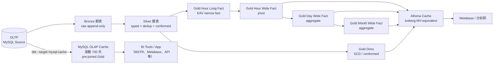

### 8.2 Bronze 銅表

目的：保留 raw source truth，不做業務邏輯，只做 ingestion metadata 補齊。

特性：

| 項目 | 規範 |
|---|---|
| 寫入模式 | append-only |
| 表格式 | Iceberg v2 |
| 資料格式 | Parquet + ZSTD |
| partition | `_ingested_date` 或 `day(_ingested_at)` |
| schema | 盡量接近 source；允許 raw JSON string |
| retention | 預設 90 天；依合規可延長 |
| mutation | 禁止 update/delete，除非 GDPR purge runbook |

必要 metadata columns：

```sql
_ingested_at        timestamp
_ingested_date      date
_source_system      varchar
_source_table       varchar
_source_file_path   varchar
_cdc_op             varchar      -- c/u/d/r or insert/update/delete/read
_cdc_ts             timestamp
_batch_id           varchar
_raw_payload        varchar      -- optional for JSON source
_record_hash        varchar      -- raw hash for idempotency
```

Bronze 範例：

```sql
-- models/bronze/bronze_orders.sql
{{ config(
    materialized='incremental',
    table_type=platform_iceberg_table_type(),
    incremental_strategy=platform_append_strategy(),
    tags=['bronze']
) }}

select
    cast(order_id as varchar) as order_id,
    cast(customer_id as varchar) as customer_id,
    cast(order_ts as timestamp) as order_ts,
    cast(amount as varchar) as amount_raw,
    current_timestamp as _ingested_at,
    current_date as _ingested_date,
    'oltp_postgres' as _source_system,
    'orders' as _source_table,
    '{{ var("source_file_path", "manual") }}' as _source_file_path,
    '{{ var("cdc_op", "r") }}' as _cdc_op,
    current_timestamp as _cdc_ts,
    '{{ var("batch_id", invocation_id) }}' as _batch_id
from {{ source('raw_oltp', 'orders') }}
```

### 8.3 Silver 銀表

目的：清理、型別轉換、去重、業務 key 標準化。**SK 不在 Silver 計算**——只保留 natural key，儲存空間最小；Gold 層才是 SK 第一次出現的地方。

特性：

| 項目 | 規範 |
|---|---|
| 寫入模式 | incremental merge |
| 主鍵 | source natural key（business key，**不做 hash**） |
| schema | 強型別，禁止 raw string 金額 / 日期 |
| 去重 | 依 source primary key + latest CDC timestamp |
| SCD | 對維度 staging 做 SCD2 snapshot |

Silver 範例：

```sql
-- models/silver/silver_orders.sql
{{ config(
    materialized='incremental',
    table_type=platform_iceberg_table_type(),
    incremental_strategy=platform_merge_strategy(),
    unique_key='order_id',          -- natural key；SK 不在 Silver
    tags=['silver']
) }}

with src as (
    select *
    from {{ ref('bronze_orders') }}
    
      where _ingested_at >= (select coalesce(max(_ingested_at), timestamp '1900-01-01') from {{ this }})
    
), dedup as (
    select *
    from (
        select
            *,
            row_number() over (
                partition by order_id
                order by _cdc_ts desc, _ingested_at desc
            ) as rn
        from src
    )
    where rn = 1
)
select
    -- natural keys（不計算 SK；Gold 層才 hash）
    cast(order_id    as varchar)        as order_id,
    cast(customer_id as varchar)        as customer_id,
    cast(order_ts    as timestamp)      as order_ts,
    cast(amount_raw  as decimal(18,2))  as amount,
    _ingested_at,
    _batch_id
from dedup
where _cdc_op <> 'd'
```

### 8.4 Gold 金表

Gold 分兩類：

1. Conformed dimensions：`dim_*`
2. Numeric fact tables：`fact_*`

本設計採用「canonical long fact + user-facing wide fact/cache」：

```text
gold.fact_metric_hour_long   -- canonical, numeric-only, EAV/narrow
gold.fact_metric_hour_wide   -- pivoted hourly serving fact
gold.fact_metric_day_wide    -- daily aggregate serving fact
gold.fact_metric_month_wide  -- monthly aggregate serving fact
```

### 8.5 Cache 層

Cache 層是 USER 查詢入口，避免 Metabase 直接掃 canonical long fact 或複雜 join。

```text
cache.user_metric_hour
cache.user_metric_day
cache.user_metric_month
cache.dashboard_revenue_daily
cache.dashboard_ops_hourly
```

Local 可以用 Trino MV；Prod 建議用 dbt-managed Iceberg table 作 MV-equivalent。原因：Athena 可以 query Glue Data Catalog materialized views，但不能 create/refresh/drop 這些 materialized views；因此 prod cache 的穩定做法是由 dbt / Airflow 產生實體 Iceberg cache table，Athena 只讀。

### 8.6 統一水位線策略

各層 incremental filter 必須使用一致的時間欄位語意；混用 ingestion time 與 business time 會造成遺漏或重複。

#### 設計原則

```text
Bronze → Silver：ingestion time（_ingested_at）
Silver → Gold long：ingestion time（_ingested_at）＋ late-arrival grace window
Gold long → Gold wide：business time（event_date / updated_at）＋ lookback window
Gold wide → MySQL Cache：business time（event_date）＋ lookback_hours/days
```

**為何兩段切換**：Bronze/Silver 的 ingestion time 是單調遞增且已知最大值（`max(_ingested_at) from this`），適合 dbt is_incremental 精確讀取。Gold 以後面向分析，應對齊業務事件日期，且需要一個 lookback window 容納 OLTP 遲到更新（例如補結案）。

#### 各層規範

| 層 | 水位線欄位 | 時間語意 | 預設 lookback | 說明 |
|---|---|---|---|---|
| Bronze | `_ingested_at` | 攝入時間 | N/A（append-only，不需 filter） | dbt append strategy 自動追加新分區 |
| Silver | `_ingested_at` | 攝入時間 | `max(_ingested_at) from this` | 精確讀取 Bronze 中比自身新的行；去重後 merge |
| Gold hour_long | `_ingested_at` | 攝入時間 | `max(_ingested_at) from this` | 讀 Silver 新增/修改行；event_date 為指標維度，非水位線 |
| Gold hour_wide | `updated_at` | 最後更新時間 | `max(updated_at) from this` | 讀 hour_long 中有更新的 grain；business date 不夠精細 |
| Gold day_wide | `date_sk` | 業務日期 | `current_date - 7 days` | 7 天滾動視窗確保補跑覆蓋；月初回補用 `--full-refresh --select` |
| Gold month_wide | `month_sk` | 業務月份 | `current_date - 2 months` | 前 2 個月允許月中補跑 |
| MySQL Cache | `event_date` | 業務日期 | `lookback_hours`（預設 26） | 業務時間優先；若有 `updated_at` 應改用 `updated_at >= NOW() - INTERVAL X` |

#### dbt 範例：統一 Silver 水位線 macro

```sql
-- macros/watermark.sql

  
    where {{ ingestion_col }} > (
      select coalesce(max({{ ingestion_col }}), timestamp '1900-01-01')
      from {{ this }}
    )
  

```

使用：

```sql
-- models/silver/silver_orders.sql
from {{ ref('bronze_orders') }}
{{ silver_watermark(ref('bronze_orders')) }}
```

#### dbt 範例：Gold wide 水位線（business time lookback）

```sql
-- macros/watermark.sql（延伸）

  
    where {{ date_col }} >= date_add(
      'day',
      -{{ var(lookback_var, default_days) }},
      current_date
    )
  

```

使用：

```sql
-- models/gold/fact_metric_day_wide.sql
from {{ ref('fact_metric_hour_wide') }}
{{ gold_wide_watermark('date_sk', 'day_wide_lookback_days', 7) }}
```

#### Late-arrival policy

| 場景 | 現象 | 處置 |
|---|---|---|
| OLTP 補結案（事件時間 T-2，ingestion T+0） | Silver 正確 merge；Gold long 正確 merge；day_wide 7-day lookback 覆蓋 | 自動修正，無需介入 |
| OLTP 補結案（事件時間 T-8，ingestion T+0） | day_wide 7-day lookback **不覆蓋**；T-8 的 day_wide 行保持舊值 | 觸發 backfill：`airflow dags trigger lakehouse_backfill --conf '{"from_date":"..."}'` |
| Silver 大量遲到（CDC lag > 2 小時） | Bronze 有資料，Silver watermark 追不上 | 檢查 CDC pipeline；若 Silver `_ingested_at` 落後 >4 小時，PagerDuty 告警 |

#### 監控告警

```yaml
# airflow/monitoring/watermark_lag_check.yml
checks:
  - name: bronze_silver_lag
    sql: |
      select max(_ingested_at) as bronze_max
      from bronze.fact_cs_hour_long
    threshold: 4h          # Silver 應在 4 小時內跟上
    alert: pagerduty

  - name: gold_freshness
    sql: |
      select max(updated_at) as gold_max
      from gold.fact_metric_hour_long
    threshold: 2h          # Gold long 應在 2 小時內更新
    alert: slack
```

---

## 9. Gold Star Schema：Fact 型別規範設計

### 9.1 原則

#### 全數字化的核心目標

「全數字化」不等於「全用整數」。核心目標是三件事：

1. **空間最小**：每個欄位選能表達語意的最小型別
2. **建 key 最快**：數字比較 O(1)，字串比較 O(n)；Iceberg min/max statistics 對數字型別最有效
3. **partition pruning 可用**：Iceberg hidden partition transform 只對 DATE / TIMESTAMP / 整數型別生效

#### 日期欄位大小比較（最重要的設計決策）

```
儲存大小（由小到大）：

  event_date DATE（單欄）     = 4 bytes/row   ← Parquet INT32 epoch days
  date_sk BIGINT YYYYMMDD    = 8 bytes/row   ← 比 DATE 多 100% 空間
  dim_date JOIN              = 4 bytes FK + 整張 dim 表的額外 I/O

建 key 速度（由快到慢）：

  DATE range compare         = INT32 直接比較，引擎原生 statistics
  BIGINT range compare       = INT64 直接比較，statistics 有效
  dim_date JOIN              = FK lookup，額外 hash join 成本

Iceberg partition pruning：

  day(event_date)            = ✅ hidden partition transform 直接運作
  BIGINT YYYYMMDD            = ❌ 無法用 transform；需手動加 partition 欄位
  dim_date JOIN              = ✅ 但 pruning 看的是事實表的 event_date，與 dim 無關
```

**結論**：`DATE` 型別在 Parquet 底層就是 INT32（epoch days），完全符合全數字化原則，且比 BIGINT YYYYMMDD 空間更小、partition pruning 更強。`dim_date` 是額外的 JOIN 成本，只有在「SQL 函數無法推導的屬性」才值得付出這個成本——詳見 9.2。

#### Gold Fact 欄位型別規範

| 欄位類型 | Fact 表規則 | 理由 |
|---|---|---|
| `event_date DATE` | **首選** | INT32 epoch days；4 bytes；Iceberg `day()` partition pruning 直接生效；Kimball date key 的 Iceberg-native 替代 |
| `date_sk BIGINT YYYYMMDD` | 可接受（legacy 相容） | 8 bytes，比 DATE 多 100%；partition pruning 需額外設定；保留供舊 RDBMS 接軌場景 |
| `hour INT（0–23）` | **必須**；不用 time_sk | 1 byte 語意完整；`time_sk BIGINT HHMMSS` 是 Kimball RDBMS 傳統，hour 粒度根本不需要秒級精度，純粹浪費 7 bytes |
| `dim_time FK` | **禁止** | hour INT 已自帶全部時間語意；dim_time 只增加 JOIN 成本，無任何新信息 |
| `dim_date FK` | **按需**；見 9.2 | 只有 `is_holiday`、`is_business_day` 等 SQL 函數無法推導的屬性才值得引入 JOIN |
| BIGINT surrogate key（entity_sk, field_sk） | **必須** | VARCHAR natural key 過寬；Kimball（1998）：integer key 在十億行可省 gigabytes |
| `month_sk BIGINT（YYYYMM）` | 可接受 | SQL 無 YEARMONTH 原生型別；用於月彙總輔助分區 |
| DECIMAL / DOUBLE measure | 必須 | fact 量值標準型別 |
| BOOLEAN | 不建議 | 轉成 0/1 INT |
| TIMESTAMP | **serving fact 禁止** | timezone 不一致；Parquet INT96/INT64 跨引擎問題；影響 partition pruning |
| VARCHAR | **fact 表禁止** | 寬行、join 效率差；改用 dim table + numeric FK |
| JSON / MAP / ARRAY | 禁止 | 放 Bronze/Silver，不放 Gold fact |

> **理論基礎**：Parquet spec §2.8：DATE 儲存為 INT32 days since Unix epoch；Kimball（1998）確立 integer surrogate key 節省儲存的原則；Trino Project（2023）記錄 Iceberg hidden partition pruning 只對 DATE/TIMESTAMP 欄位有效，INTEGER date key 不參與 transform；Schnider（2015）指出 native DATE 型別對 optimizer cardinality 估算更準確。

### 9.2 Dimension tables

#### `gold.dim_date`

**何時需要 dim_date？**

| 需求 | 直接 `event_date DATE` 夠嗎？ | 需要 dim_date？ |
|---|---|---|
| GROUP BY 年/月/季/週/日 | ✅ `YEAR()`、`DATE_TRUNC()` | 否 |
| YTD / MTD / QTD 條件 | ✅ `WHERE event_date >= DATE_TRUNC(...)` | 否 |
| Iceberg partition pruning | ✅ `day(event_date)` 原生 | 否 |
| dbt incremental 條件 | ✅ DATE 直接比較 | 否 |
| 法定假日 / 補班日 | ❌ SQL 函數無法推算 | **是** |
| 工作日精確平均 KPI | ❌ 只能排週末，無法排假日 | **是** |

**結論**：dim_date 存在的唯一理由是 `is_holiday` 和 `is_business_day`——這兩個值 SQL 函數永遠算不出來。所有標準 ISO 曆法的時間分組直接用 `event_date DATE` + SQL 函數，不需要 JOIN dim_date。

**精簡版 dim_date（只留 SQL 函數無法推導的欄位）：**

```sql
-- gold.dim_date（主鍵直接用 DATE，不用整數 SK）
date_key        date        -- PK；事實表 JOIN ON event_date = date_key
year            smallint    -- 可用 YEAR() 算，預計算省 CPU
quarter         tinyint     -- 1–4
month           tinyint     -- 1–12
week_of_year    tinyint     -- ISO week 1–53
day_of_week     tinyint     -- 1=Mon … 7=Sun（ISO）
is_weekend      int         -- 0/1；DAYOFWEEK IN (6,7)
-- 以下是 dim_date 存在的核心理由：SQL 函數無法推導
is_holiday      int         -- 0/1；台灣/美國法定假日
is_business_day int         -- 0/1；NOT (is_weekend OR is_holiday)
holiday_name    varchar     -- 節假日名稱，NULL 表示非假日
```

> 刻意不放：`date_name`（DATE 本身即可讀）、`fiscal_*`（無此需求時省略）、任何整數 surrogate key（DATE 直接當 PK JOIN，不需中轉）。

#### `gold.dim_time`（**不建立，直接用 `hour INT`**）

**結論：dim_time 不需要。**

`hour INT（0–23）` 已是最小、最完整的時間表達：

```
比較（時間維度的選項）：

  hour INT（0–23）         = 1 byte；所有時間分組可直接算；無任何 JOIN 成本
  time_sk BIGINT HHMMSS   = 8 bytes；hour 粒度根本不需要秒級，純粹浪費 7 bytes
  dim_time JOIN           = 額外 FK + JOIN + 整張 dim 表 I/O；不帶任何新信息

dim_time 唯一有意義的欄位：
  is_business_hour INT    -- 上班時間 0/1
```

`is_business_hour` 是 dim_time 存在的唯一理由。但它等於 `CASE WHEN hour BETWEEN 9 AND 18 THEN 1 ELSE 0 END`——**一個 CASE WHEN 就能表達，不值得為此建一張 JOIN 表**。

如未來需秒級粒度（秒級 SLA 量測），再引入 `event_time TIME` 欄位直接存在事實表，仍不需要 dim_time。

#### `gold.dim_field`

```sql
field_sk bigint       -- stable_hash64_number('field|' || field_code)
field_code varchar    -- e.g. revenue_amount
field_name varchar
field_type varchar    -- metric / attribute / status
value_type varchar    -- decimal / double / integer
hour_to_day_agg varchar
 day_to_month_agg varchar
expose_to_bi int      -- 0/1
is_active int         -- 0/1
```

#### Business dimensions

範例：`dim_customer`, `dim_product`, `dim_region`, `dim_source_system`。

Fact 只存 `customer_sk`, `product_sk`, `region_sk`, `source_system_sk`。

### 9.3 PII 資料處理策略（去識別化 + 假名化）

#### 核心原則

**原始 PII 不進 DB。** Bronze 層 ingestion 是唯一進入點；到達 DB 前即在 Lambda / Glue Job / Kafka Consumer 端完成轉換，之後所有層只存轉換後的值。

兩種轉換同時並行，缺一不可：

| 轉換 | 中文 | 目的 | 輸出欄位後綴 |
|---|---|---|---|
| **遮照（Masking）** | 去識別化 | 人看不出原始值；BI / report 可展示 | `_masked` |
| **Hash 假名（Pseudonymization）** | 假名化 | 相同輸入永遠產出相同 hash key；可跨表 JOIN，不含原始值 | `_pk` (hash BIGINT) |

> 去識別化（de-identification）：移除或模糊資料，使個人無法被重新識別。  
> 假名化（pseudonymization）：以一致性假名（hash）替代真實識別碼，保留關聯性但不暴露原值。

#### PII 欄位分類

| 類別 | 欄位舉例 | 處理方式 |
|---|---|---|
| **直接識別碼** | email、phone、national_id、passport | mask + hash，原值不存 |
| **準識別碼** | full_name、DOB、zip_code、IP | mask + hash，或聚合後才存 |
| **敏感屬性** | health_condition、salary、religion | 需明確授權才進 DB；否則整欄棄除 |
| **非 PII** | session_id、product_id、event_type | 正常存放，無需處理 |

#### 各層規範

| 層 | 角色 | PII 規範 |
|---|---|---|
| **Bronze** | append-only raw staging | 原始 PII **不落地**；ingestion 端完成 mask + hash 後只寫入 `_masked` / `_pk` 欄位；schema 裡不存在原始 PII 欄位名稱 |
| **Silver** | dedup + atomize | 繼承 Bronze 的 `_masked` / `_pk`；不做二次轉換；natural key 仍為 `_pk` hash |
| **Gold DIM** | dimension tables | 只存必要可展示欄位（`_masked`）；不存 `_pk` 以外的識別碼；如無展示需求則連 `_masked` 也棄除 |
| **Gold FACT** | long / wide fact | 只存 `_pk`（BIGINT foreign key）；不存任何 `_masked` 或原始值 |
| **MySQL Cache** | OLAP hot tier | 不存 PII；如有展示需求只接受 Gold DIM 的 `_masked`，且需明確授權 |

#### 實作：Ingestion 端 dbt macro

```sql
-- dbt/macros/privacy/mask_email.sql
-- 遮照：保留 domain，隱藏 local part（u***@example.com）

  case
    when {{ col }} is null then null
    when {{ col }} not like '%@%' then '***'
    else
      left({{ col }}, 1)
      || '***'
      || substring({{ col }}, strpos({{ col }}, '@'))
  end


-- dbt/macros/privacy/mask_phone.sql
-- 遮照：保留後 4 碼，其餘以 * 替換（***-***-1234）

  case
    when {{ col }} is null then null
    else '***-***-' || right(regexp_replace({{ col }}, '[^0-9]', ''), 4)
  end

```

```sql
-- dbt/macros/privacy/pii_hash.sql
-- 假名化：與 stable_hash64_number 使用相同邏輯，加 'pii:' namespace
-- 確保即使 natural key 相同，PII hash 與業務 SK 也不衝突

  {{ stable_hash64_number(namespace ~ ':' ~ col) }}

```

Bronze 層 staging model 範例（`stg_bronze_users.sql`）：

```sql
select
  -- PII 欄位：只保留去識別化版本
  {{ mask_email('raw_email') }}             as email_masked,
  {{ pii_hash('raw_email') }}               as email_pk,

  {{ mask_phone('raw_phone') }}             as phone_masked,
  {{ pii_hash('raw_phone') }}               as phone_pk,

  -- 非 PII 欄位：正常保留
  user_type,
  created_at,
  source_system

  -- raw_email, raw_phone 欄位故意不 SELECT — 不落地
from {{ source('raw', 'users') }}
```

#### 存取控制

```text
Bronze raw source  → restricted IAM role 限制（Glue / S3 raw prefix）
Bronze staging     → data_engineer role（已去識別化）
Silver / Gold      → analyst role
MySQL Cache        → bi_reader role（無 _pk 欄位直接暴露）
```

> 注意：`_pk`（hash BIGINT）本身不含 PII，但持有原始值的人可重算 hash；因此 `_pk` 欄位不等於「安全」，仍需欄位層級 ACL 防止逆向對照。

---

### 9.4 Hash number function

需求：把 natural key 轉為 BIGINT surrogate key，讓 fact 的 entity/field FK 維持 numeric 型別。

規範：

1. 所有 hash key 都要加 namespace，避免不同 domain key 撞語意。
2. 所有輸入都要標準化：trim、lower、null marker、delimiter escaping。
3. 輸出使用非負 BIGINT。
4. 每個 dimension 必須做 collision detection。
5. 高價值核心 dimension 可改用 managed surrogate key mapping table，而不是純 hash。

建議 macro：

```sql
-- dbt/macros/platform/stable_hash64_number.sql
--
-- 使用 xxhash64：Trino（local）與 Athena engine v3（prod）的原生函數完全一致，
-- 無需 engine dispatch，兩端結果位元相同。
-- bitwise_and(..., 9223372036854775807) 清除符號位，確保輸出為非負 BIGINT。
--

  bitwise_and(
    from_big_endian_64(xxhash64(to_utf8(coalesce(cast({{ expr }} as varchar), '__NULL__')))),
    9223372036854775807
  )

```

> **Athena engine 版本要求**：`xxhash64` 在 Athena engine v3（基於 Trino，AWS 目前預設）原生支援。Athena engine v2（基於 Presto 0.217）不支援，若仍使用 v2 請改用下方 Fallback macro，並加入 migration plan 升級至 v3。

Athena v2 Fallback（過渡期）：

```sql
-- dbt/macros/platform/stable_hash64_number.sql  (v2 fallback)
-- 取 md5 前 8 bytes 作為 64-bit hash，僅用於 Athena engine v2 環境。

  bitwise_and(
    from_big_endian_64(substr(md5(to_utf8(coalesce(cast({{ expr }} as varchar), '__NULL__'))), 1, 8)),
    9223372036854775807
  )

```

> **重要**：v2 fallback 與 v3 實作的 hash 值不同（md5 vs xxhash64），兩者不可混用於同一張表。切換時必須對所有受影響的 dimension / fact 表執行 `--full-refresh`。

CI smoke test（必須通過才能合併）：

```bash
# 驗證 Trino 與 Athena 對同一輸入產出相同數值
python platform/smoke_hash_function.py \
  --trino-target local-trino \
  --athena-target prod-athena \
  --input "order|RM12345"
# 預期：兩端輸出完全相同的 BIGINT
```

#### 9.3.1 Lookup query pattern（WHERE 條件查詢）

`stable_hash64_number` 同時作為 **write-time surrogate key 產生器** 與 **read-time lookup 函數**，兩者輸入格式必須完全一致（namespace + delimiter + natural key）。

類比 BigQuery `FARM_FINGERPRINT()`：

| 平台 | 函數 | 輸出型別 |
|------|------|---------|
| BigQuery | `FARM_FINGERPRINT('order\|RM12345')` | INT64 |
| Trino / Athena v3 | `stable_hash64_number('order\|RM12345')` | BIGINT |

**寫入時**（Silver dbt model）：

```sql
{{ stable_hash64_number("'order|' || order_id") }} as order_sk,
```

**查詢時**（BI SQL / Athena 查詢）：

```sql
-- 原始查詢（natural key，需要 string index）
SELECT order_code, order_qty, order_price
FROM orders
WHERE order_code = 'RM12345';

-- Hash key 查詢（surrogate key，走 Iceberg partition pruning）
SELECT order_sk, order_qty, order_price
FROM orders
WHERE order_sk = {{ stable_hash64_number("'order|RM12345'") }};
-- 展開後：
-- WHERE order_sk = bitwise_and(
--   from_big_endian_64(xxhash64(to_utf8('order|RM12345'))),
--   9223372036854775807
-- )
```

> namespace（`order|`）必須與寫入時完全一致，否則 hash 值不符，查不到資料。namespace 定義應統一放在 `contracts/metrics/namespace_registry.yml`（獨立於 `field_registry.yml`，後者管理 metric field，前者管理 entity hash namespace），避免散落在各 SQL 中。`generate_pivot_models.py` 與 dbt model 應從此 registry 讀取 namespace，不得 hardcode。

Collision detection：

```sql
select
  customer_sk,
  count(distinct customer_natural_key) as natural_key_count
from gold.dim_customer
where is_current = 1
group by 1
having count(distinct customer_natural_key) > 1;
```

若有資料列，pipeline 必須 fail。

### 9.5 Canonical hour long fact

這張是最重要的 canonical fact。它符合使用者提出的：

```text
date, time, field, value
```

#### 9.4.1 理論基礎與業界實踐

此設計模式稱為 **EAV Narrow Fact**（Entity-Attribute-Value），有充分的學術與工程依據：

| 來源 | 對應核心觀點 |
|---|---|
| **Kimball Group (2008)** _The Data Warehouse Toolkit_ | 提出 Factless Fact 與 Accumulating Snapshot；EAV narrow fact 是對「動態 metric」場景的現代延伸，適用於 metric 欄位集合不固定的 domain |
| **Google Analytics 4（2020）** | 採用 `event + event_param[]` 完全 EAV 模型；BigQuery Export 輸出 narrow 格式，再以 `UNNEST` + `PIVOT` 展開為寬表供 BI 查詢 |
| **Segment / Snowplow** | Track event 以 narrow 格式落地；Connections / Transformations 層自動 pivot 成 warehouse-specific wide table，Business 可自定義欄位集合 |
| **dbt MetricFlow（2023）** | 官方 semantic layer 以 `measure + dimension` narrow grain 作為所有指標的定義基礎；exposure 層才 pivot 成寬列格式 |
| **Apache Druid / Apache Pinot** | Real-time OLAP 以 narrow event 格式索引，支援動態 groupby 而無需預先定義寬表 schema |
| **Lambda Architecture（Nathan Marz, 2011）** | 批次層（已固化 day/month wide table）＋ 速度層（today hourly sum）= 完整報表視圖；UNION ALL 是此架構在 serving 層的標準實作 |

**動態欄位的核心商業價值：**

```text
新增一個指標（e.g., cart_abandonment_rate）：
  舊做法：ALTER TABLE fact_wide ADD COLUMN ...  → DDL 鎖表、歷史為 NULL、需重跑
  本設計：field_registry.yml 新增一列 + dbt run → zero DDL、自動回填、不影響其他欄位
```

型別規範：date_sk 用 DATE、hour 用 INT（0–23），entity/field SK 用 BIGINT hash：

```sql
CREATE TABLE gold.fact_metric_hour_long (
    date_sk date,           -- 推薦 DATE；相容 bigint YYYYMMDD
    hour int,               -- 0–23；取代 time_sk bigint HHMMSS
    month_sk bigint,        -- yyyymm，月彙總輔助鍵
    entity_sk bigint,
    field_sk bigint,
    value_decimal decimal(38,12),
    value_double double,
    source_system_sk bigint,
    load_batch_sk bigint,
    row_hash_sk bigint,
    updated_at timestamp     -- 僅作 audit trail；不放 serving query
)
```

語意：

| 欄位 | 說明 |
|---|---|
| `date_sk` | 日期 FK，join `dim_date`；DATE 型別參與 Iceberg partition pruning |
| `hour` | 小時，0–23；直接存值無需 dim_time join |
| `month_sk` | 月份輔助 key，方便月彙總分區 |
| `entity_sk` | 分析主體，例如 customer/product/site/account 的 hash key；依 domain 可拆成多個 dim key |
| `field_sk` | 指標欄位 key，join `dim_field` |
| `value_decimal` | 精準數值，例如金額、count |
| `value_double` | 比率、近似值、平均值 |
| `source_system_sk` | 來源系統 FK |
| `load_batch_sk` | batch FK |
| `row_hash_sk` | row identity / idempotency |
| `updated_at` | audit timestamp；不出現在 serving query |

範例資料：

| date_sk | hour | entity_sk | field_sk | value_decimal |
|---|---:|---:|---:|---:|
| 2026-05-12 | 13 | 101 | 9001 | 25 |
| 2026-05-12 | 13 | 101 | 9002 | 5023.75 |
| 2026-05-12 | 14 | 101 | 9001 | 32 |

這是 EAV / narrow fact，優點是 metric 欄位可動態擴展；缺點是 BI 查詢通常不友善，所以必須 pivot 成 serving wide fact。

### 9.6 Hour wide fact（反轉表 / pivot）

> **本節 SQL 由 `platform/generate_pivot_models.py` 自動生成**，請勿手動編輯 `dbt/models/gold/generated/fact_metric_hour_wide.sql`。以下為設計規格，供理解生成邏輯。

由 `field_registry.yml` 驅動。weighted_avg 指標（如 `conversion_rate`）必須額外暴露 `_num` / `_den` component 欄位，day_wide 才能跨小時正確加總分子分母，而非累加比率值。

```sql
CREATE TABLE gold.fact_metric_hour_wide (
    date_sk date,              -- 推薦 DATE；相容 bigint YYYYMMDD
    hour int,                  -- 0–23
    month_sk bigint,
    entity_sk bigint,
    source_system_sk bigint,
    -- simple metrics（sum / max）
    orders_count decimal(38,12),
    revenue_amount decimal(38,12),
    active_users decimal(38,12),
    -- weighted_avg: 暴露分子分母，BI 層隱藏
    conversion_rate_num decimal(38,12),  -- conversions 原始值
    conversion_rate_den decimal(38,12),  -- sessions 原始值
    conversion_rate double,              -- 本小時比率（BI 顯示）
    updated_at timestamp                 -- 水位線欄位；audit only
)
```

生成 SQL 規格（`generate_pivot_models.py` 輸出）：

```sql
-- AUTO-GENERATED — dbt/models/gold/generated/fact_metric_hour_wide.sql
{{ config(
    materialized='incremental',
    table_type=platform_iceberg_table_type(),
    incremental_strategy=platform_merge_strategy(),
    unique_key=['date_sk', 'hour', 'entity_sk'],
    tags=['gold', 'hour', 'pivot']
) }}

with src as (
    select * from {{ ref('fact_metric_hour_long') }}
    
    -- 水位線：ingestion time（見 §8.6）
    where updated_at >= (
        select coalesce(max(updated_at), timestamp '1900-01-01')
        from {{ this }}
    )
    
)
select
    date_sk, hour, month_sk, entity_sk, source_system_sk,
    -- sum metrics
    sum(case when field_sk = {{ field_sk('orders_count') }}  then value_decimal else 0 end) as orders_count,
    sum(case when field_sk = {{ field_sk('revenue_amount') }} then value_decimal else 0 end) as revenue_amount,
    -- max metrics
    max(case when field_sk = {{ field_sk('active_users') }}  then value_decimal else 0 end) as active_users,
    -- weighted_avg: 分子分母分開儲存（day_wide 正確加總用）
    sum(case when field_sk = {{ field_sk('conversions') }} then value_decimal else 0 end) as conversion_rate_num,
    sum(case when field_sk = {{ field_sk('sessions') }}    then value_decimal else 0 end) as conversion_rate_den,
    try_cast(
      sum(case when field_sk = {{ field_sk('conversions') }} then value_decimal else 0 end) /
      nullif(sum(case when field_sk = {{ field_sk('sessions') }} then value_decimal else 0 end), 0)
    as double) as conversion_rate,
    max(updated_at) as updated_at
from src
group by 1,2,3,4,5
```

### 9.7 Day wide fact

> **本節 SQL 由 `platform/generate_pivot_models.py` 自動生成**。

Day table 從 Hour wide 聚合。weighted_avg 指標使用 `_num` / `_den` component 欄位重新計算，**不**直接對比率值做平均：

```sql
-- AUTO-GENERATED — dbt/models/gold/generated/fact_metric_day_wide.sql
{{ config(
    materialized='incremental',
    table_type=platform_iceberg_table_type(),
    incremental_strategy=platform_merge_strategy(),
    unique_key=['date_sk', 'entity_sk'],
    tags=['gold', 'day', 'pivot']
) }}

with src as (
    select * from {{ ref('fact_metric_hour_wide') }}
    
    -- 水位線：business time 7-day lookback（見 §8.6）
    where date_sk >= date_add('day', -{{ var('day_wide_lookback_days', 7) }}, current_date)
    
)
select
    date_sk, month_sk, entity_sk, source_system_sk,
    sum(orders_count)  as orders_count,
    sum(revenue_amount) as revenue_amount,
    max(active_users)  as active_users,
    -- weighted_avg: 正確做法是對分子分母分別加總
    sum(conversion_rate_num) as conversion_rate_num,
    sum(conversion_rate_den) as conversion_rate_den,
    try_cast(
      sum(conversion_rate_num) / nullif(sum(conversion_rate_den), 0)
    as double) as conversion_rate,
    max(updated_at) as updated_at
from src
group by 1,2,3,4
```

> **反例（錯誤做法）**：`avg(conversion_rate)` 或 `sum(conversion_rate)` 會因各小時 session 量不同而產生錯誤的加權結果。正確做法是存 num+den，在 serving 層才除。

### 9.8 Month wide fact

> **本節 SQL 由 `platform/generate_pivot_models.py` 自動生成**。

Month table 從 Day wide 聚合，同樣使用 `_num` / `_den` component 正確重新計算比率：

```sql
-- AUTO-GENERATED — dbt/models/gold/generated/fact_metric_month_wide.sql
{{ config(
    materialized='incremental',
    table_type=platform_iceberg_table_type(),
    incremental_strategy=platform_merge_strategy(),
    unique_key=['month_sk', 'entity_sk'],
    tags=['gold', 'month', 'pivot']
) }}

with src as (
    select * from {{ ref('fact_metric_day_wide') }}
    
    -- 水位線：business time 2-month lookback（見 §8.6）
    where month_sk >= cast(
      date_format(date_add('month', -{{ var('month_wide_lookback_months', 2) }}, current_date), '%Y%m')
    as bigint)
    
)
select
    month_sk, entity_sk, source_system_sk,
    sum(orders_count)   as orders_count,
    sum(revenue_amount) as revenue_amount,
    max(active_users)   as active_users,
    sum(conversion_rate_num) as conversion_rate_num,
    sum(conversion_rate_den) as conversion_rate_den,
    try_cast(
      sum(conversion_rate_num) / nullif(sum(conversion_rate_den), 0)
    as double) as conversion_rate,
    max(updated_at) as updated_at
from src
group by 1,2,3
```

### 9.9 Left join dim table

Fact 可透過 DATE FK join dim；hour 欄位直接使用，無需 dim_time join：

```sql
select
    f.date_sk,
    f.hour,
    c.customer_name,
    f.orders_count,
    f.revenue_amount,
    f.conversion_rate
from cache.user_metric_hour f
left join gold.dim_customer c
  on f.entity_sk = c.customer_sk
where f.date_sk >= date '2026-05-01'
```

對 Metabase 使用者，建議不直接查 `gold.fact_metric_hour_long`，而是查 `cache.user_metric_hour/day/month`。

### 9.10 即時日報表：UNION ALL 模式（1-hour SLA）

#### 9.9.1 設計動機

業務需求：每日報表需在 1 小時內反映最新數據，但全天 aggregate 在當天無法使用「已固化的 day_wide」。

解法：Lambda Architecture 在 serving 層的直接應用——

```text
今天（速度層）= SUM(fact_metric_hour_wide)  WHERE date_sk = TODAY
昨天以前（批次層）= fact_metric_day_wide     WHERE date_sk < TODAY
日報表視圖 = 速度層 UNION ALL 批次層
```

#### 9.9.2 SLA 推導

```text
昨天以前：day_wide 已固化 → 查詢延遲 ≈ 0（cache 命中）
今天：最新一筆 hour_wide = pipeline 完成時間
      若 pipeline 每小時執行，最大延遲 = pipeline lag（通常 < 15 min）
      → 符合 1-hour SLA
```

#### 9.9.3 Serving view SQL 範例

**Athena / Trino（prod）：**

```sql
-- cache.report_daily_metric
-- 日報表：昨天以前用 day_wide；今天用 hour_wide SUM
-- 此 view 由 dbt 管理，Metabase 直查此層
CREATE OR REPLACE VIEW cache.report_daily_metric AS

-- 批次層：已固化的日彙總（D-1 以前）
SELECT
    f.date_sk,
    c.customer_name,
    f.entity_sk,
    f.orders_count,
    f.revenue_amount,
    f.conversion_rate,
    'batch'               AS source_tier,
    f.date_sk             AS freshness_as_of
FROM gold.fact_metric_day_wide f
LEFT JOIN gold.dim_customer c ON f.entity_sk = c.customer_sk AND c.is_current = 1
WHERE f.date_sk < CURRENT_DATE

UNION ALL

-- 速度層：今天的小時彙總（D+0 intraday）
SELECT
    f.date_sk,
    c.customer_name,
    f.entity_sk,
    SUM(f.orders_count)                                                         AS orders_count,
    SUM(f.revenue_amount)                                                       AS revenue_amount,
    TRY_CAST(
        SUM(f.orders_count * f.conversion_rate) / NULLIF(SUM(f.orders_count), 0)
        AS double
    )                                                                           AS conversion_rate,
    'intraday_hourly_sum' AS source_tier,
    MAX(f.date_sk)        AS freshness_as_of
FROM gold.fact_metric_hour_wide f
LEFT JOIN gold.dim_customer c ON f.entity_sk = c.customer_sk AND c.is_current = 1
WHERE f.date_sk = CURRENT_DATE
GROUP BY f.date_sk, c.customer_name, f.entity_sk;
```

**MySQL Hot Cache 對應（BI 低延遲層）：**

```sql
-- MySQL 的 UNION ALL 版本，今天的小時彙總從 Athena 同步或 OLTP 直接計算
CREATE OR REPLACE VIEW gold_cache.report_daily_metric AS
SELECT date_sk, entity_sk, orders_count, revenue_amount, conversion_rate,
       'batch' AS source_tier
FROM   gold_cache.fact_metric_day_wide
WHERE  date_sk < CURDATE()

UNION ALL

SELECT date_sk, entity_sk,
       SUM(orders_count), SUM(revenue_amount),
       SUM(orders_count * conversion_rate) / NULLIF(SUM(orders_count), 0),
       'intraday_hourly_sum'
FROM   gold_cache.fact_metric_hour_wide
WHERE  date_sk = CURDATE()
GROUP  BY date_sk, entity_sk;
```

#### 9.9.4 架構示意

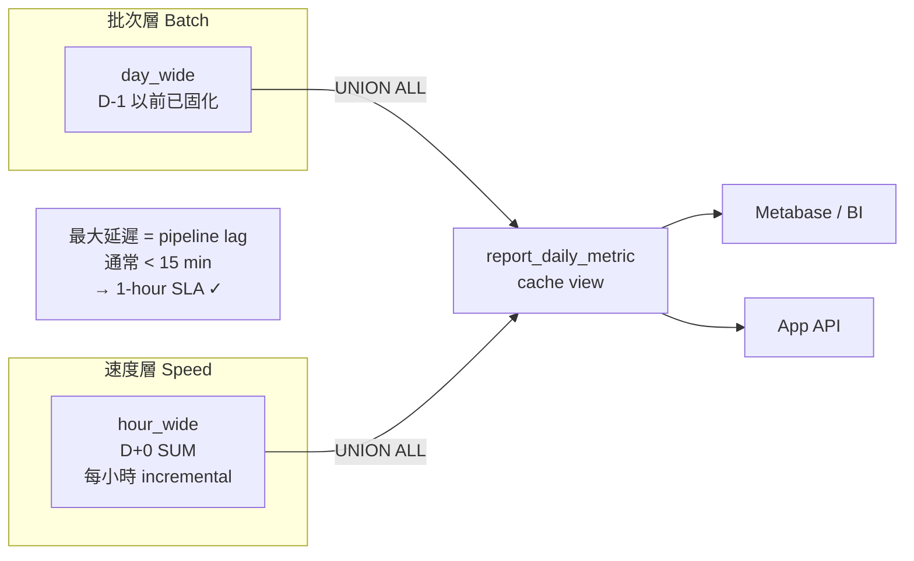

#### 9.9.5 邊界案例處理

| 情況 | 處理方式 |
|---|---|
| 今天 hour_wide 尚無資料（00:00–01:00） | UNION ALL 速度層回傳 0 列，不影響批次層 |
| Pipeline 延誤超過 2 小時 | SLA breach；觸發 Airflow alert；Metabase 顯示 `source_tier = 'intraday_hourly_sum'` 可讓用戶感知新鮮度 |
| 跨日邊界（23:58 的資料） | hour_wide 的 `date_sk = CURRENT_DATE - 1`，下一次 day_wide 跑完前以批次層補齊 |
| 加總指標（sum）vs 比率指標（avg/ratio） | 比率指標不可直接 SUM，需用加權平均公式（見 SQL 範例中 conversion_rate 計算） |

#### 9.9.6 dbt 管理方式

```yaml
# models/cache/report_daily_metric.yml
models:
  - name: report_daily_metric
    description: >
      日報表 UNION ALL 視圖。D-1 以前使用已固化 day_wide（batch tier），
      D+0 使用 hour_wide SUM（intraday speed tier）。最大延遲 < 1 小時。
    config:
      materialized: view          # view 即可；底層資料已在 wide table 快取
      tags: [cache, serving, daily]
    columns:
      - name: source_tier
        description: "'batch' = 歷史固化；'intraday_hourly_sum' = 當日小時彙總"
      - name: freshness_as_of
        description: 資料新鮮度日期，供 BI 顯示資料截止時間
    tests:
      - not_null: [date_sk, entity_sk]
      - accepted_values:
          column: source_tier
          values: [batch, intraday_hourly_sum]
```

---

## 10. USER 端 MV / Cache 設計

### 10.1 是否可行

可行，但要分 local/prod：

| 環境 | 實作方式 | 原因 |
|---|---|---|
| Local Trino | 可用 Trino Iceberg materialized view，或 dbt table | Trino Iceberg connector 支援 MV management |
| Prod Athena | 建議用 dbt-managed Iceberg cache table | Athena 可 query Glue Data Catalog MV，但不能 create/refresh/drop/modify MV |
| Prod Spark/Glue optional | 可用 Spark/Glue 建 Glue Data Catalog MV，再由 Athena read | 複雜度較高，Phase 2 再評估 |

### 10.2 Cache table 命名

```text
cache.user_metric_hour
cache.user_metric_day
cache.user_metric_month
cache.dashboard_sales_daily
cache.dashboard_ops_hourly
```

### 10.3 Cache freshness contract

`contracts/tables/cache.user_metric_day.yml`

```yaml
table: cache.user_metric_day
source: gold.fact_metric_day_wide
refresh:
  schedule: hourly
  max_staleness_minutes: 90
  mode:
    local: trino_mv_or_table
    prod: dbt_incremental_table
tests:
  - freshness: updated_at_sk within 90 minutes
  - not_null: [date_sk, entity_sk]
  - row_count_min: 1
```

### 10.4 Local Trino MV 範例

```sql
CREATE MATERIALIZED VIEW cache.user_metric_day
WITH (
  format = 'PARQUET',
  partitioning = ARRAY['month_sk']
) AS
select
  f.date_sk,
  f.month_sk,
  f.entity_sk,
  d.calendar_date,
  f.orders_count,
  f.revenue_amount,
  f.conversion_rate
from gold.fact_metric_day_wide f
left join gold.dim_date d on f.date_sk = d.date_sk;

REFRESH MATERIALIZED VIEW cache.user_metric_day;
```

### 10.5 Prod dbt cache table 範例

```sql
-- models/cache/user_metric_day.sql
{{ config(
    materialized='incremental',
    table_type=platform_iceberg_table_type(),
    incremental_strategy=platform_merge_strategy(),
    unique_key=['date_sk', 'entity_sk'],
    tags=['cache', 'user']
) }}

select
  f.date_sk,
  f.month_sk,
  f.entity_sk,
  d.calendar_date,
  c.customer_name,
  f.orders_count,
  f.revenue_amount,
  f.conversion_rate,
  f.updated_at_sk
from {{ ref('fact_metric_day_wide') }} f
left join {{ ref('dim_date') }} d on f.date_sk = d.date_sk
left join {{ ref('dim_customer') }} c on f.entity_sk = c.customer_sk

where f.date_sk >= date '{{ var("rebuild_from_date", "1900-01-01") }}'

```

Metabase 只連 `cache.*` 或 `gold.*_wide`，不連 Bronze/Silver。

---

### 10.6 MySQL OLAP Cache（Hot Tier / 近兩年滾動快取）

> **設計定位**：本節描述的 MySQL OLAP Cache 是通用 Hot Tier 設計，適用於任何需要低延遲查詢近期資料的 BI 工具或應用系統。不綁定特定 BI 軟體，下游消費者可以是 Metabase、自建報表、API 服務等。

#### 10.6.1 背景與動機

當 BI 工具對含大量 JOIN 的 Gold VIEW 發出多條平行查詢時，Athena 因重複計算全量資料而產生 timeout 或費用暴衝。根本原因是 VIEW 的 17 個 LEFT JOIN 在每次查詢時重新執行。

解法遵循 **CQRS + Materialized View Pattern**（見 Section 1.5）：將計算成本從查詢時間移到寫入時間，以預計算扁平 Gold 表（pre-joined flat table）替代 VIEW，讓下游查詢只需 index scan。

MySQL OLAP Cache 的設計目標：

1. dbt 預計算 Gold 扁平表，消除 VIEW 重複 JOIN 計算。
2. MySQL 作為 **Hot Tier**：只保留近 730 天滾動資料，以 RANGE PARTITION by DAY + covering index 替代 Iceberg partition pruning。
3. Athena Iceberg 作為 **Cold Tier**：保留完整歷史，繼續作為 analytical 與 DR source of truth。
4. **SLA：架構設計支援每小時更新；目前實際排程每日一次，可隨需求調整為每小時，不需改表結構。**
5. BI 工具直連 MySQL，查詢延遲目標 < 100ms。

#### 10.6.2 資料量分析

| 指標 | 數值 | 說明 |
|------|------|------|
| 每日更新筆數 | ~100,000 筆 | fact 表每日新增/更新量 |
| 保留天數 | 730 天（滾動） | 近 2 年，非固定年份邊界 |
| 預估總筆數 | ~7,300 萬筆 | 100k × 730 |
| 每列欄位數 | ~30-50 欄（含 JOIN 展開） | 全數字化 fact + dim 展開欄位 |
| 預估表大小 | ~15-30 GB | 依欄位寬度估算，InnoDB row format DYNAMIC |
| MySQL 適用性 | ✅ 可承受 | InnoDB 千萬級可管理；7300 萬筆需 RANGE PARTITION |

> 7300 萬筆對 MySQL InnoDB 屬邊界規模。**強制使用 RANGE PARTITION**（見 10.6.5），分區後每個 daily partition 約 10 萬筆，單分區查詢效能遠優於全表 index scan。

#### 10.6.3 設計邊界

| 項目 | 決策 | 理由 |
|------|------|------|
| MySQL 是否另建 Bronze / Silver | 否 | MySQL 已有 OLTP 來源表，dbt Gold model 直接從這些表計算 |
| 歷史資料是否入 MySQL | 否 | Hot Tier 只保留近 730 天；Athena Iceberg 負責全量歷史 |
| 更新頻率（SLA） | 架構支援每小時；目前排程每日 | Airflow 參數化 lookback window，改 cron 即可升至每小時，表結構不變 |
| 同步方向 | Athena 與 MySQL 各自獨立從 OLTP source 計算 | 兩端 source 表結構相同；dbt 同一份 model SQL 對兩端跑 |
| Airflow 執行順序 | Athena Gold 先跑完 → MySQL Gold 後跑 | Athena 為 source of truth；MySQL 失敗不影響 Athena |
| BI 工具綁定 | 無綁定 | 任何支援 MySQL 協定的工具均可連接 |
| dbt-mysql adapter 版本 | 需鎖定並驗證 | dbt-mysql 是社群套件（非 dbt Labs 官方）；需驗證所選版本對 RANGE PARTITION 表的 `delete+insert` 行為（DELETE 是否含 partition column，確保 pruning 有效） |
| MySQL Read Replica | 目前不做；Phase 2 評估 | 若 BI 工具並發查詢量高，單一實例成為瓶頸時加入 read replica；partition rotation 與 read replica 相容（replica 同步 DDL） |

#### 10.6.4 資料流

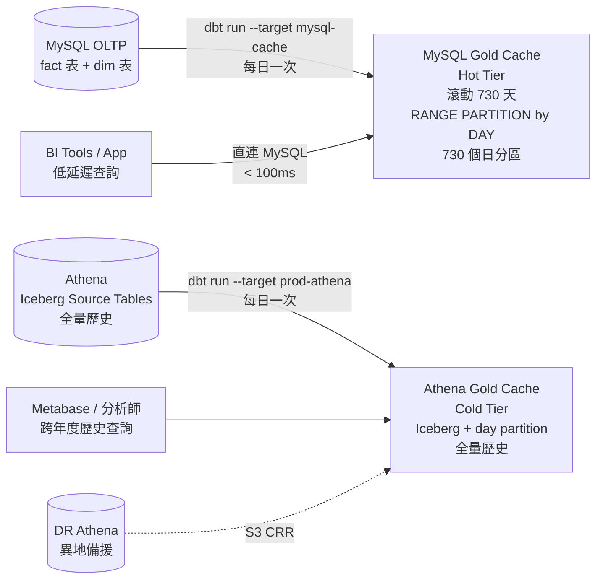

#### 10.6.5 MySQL RANGE PARTITION Rotation（滾動視窗機制）

**為何用 RANGE PARTITION by DAY 而非 DELETE 或月分區**：

| 方案 | 問題 |
|------|------|
| Row-level DELETE | 7300 萬筆長時間持 InnoDB gap lock，查詢被阻塞 |
| 月分區（25 個） | 每小時 incremental 查詢仍需掃整個月份分區（~300 萬筆），partition pruning 不夠精準 |
| **日分區（730 個）** | `DROP PARTITION` 瞬間完成不持鎖；每小時增量查詢只命中 1-2 個日分區（~10 萬筆），pruning 精準 |

> MySQL 支援最多 8192 個分區；730 個 daily partition 在安全範圍內。

建表時按天分區：

```sql
CREATE TABLE gold_cache.mv_case_handling_detail (
    prblm_code      VARCHAR(50)  NOT NULL,
    prblm_sysdate   DATETIME     NOT NULL,
    -- ... 其餘欄位
    updated_at      DATETIME     NOT NULL DEFAULT CURRENT_TIMESTAMP ON UPDATE CURRENT_TIMESTAMP,
    PRIMARY KEY (prblm_code, prblm_sysdate)   -- 分區鍵必須包含在 PK 中
) ENGINE=InnoDB
  ROW_FORMAT=DYNAMIC
  PARTITION BY RANGE (TO_DAYS(prblm_sysdate)) (
    PARTITION p2024_05_13 VALUES LESS THAN (TO_DAYS('2024-05-14')),
    PARTITION p2024_05_14 VALUES LESS THAN (TO_DAYS('2024-05-15')),
    -- ... 初始建立 730 天（用腳本生成，非手動）
    PARTITION p2026_05_12 VALUES LESS THAN (TO_DAYS('2026-05-13')),
    PARTITION p_future    VALUES LESS THAN MAXVALUE
);
```

**Rotation 邏輯（兩階段輪轉，每日執行）**：

```
目的：保留近 730 天 + 30 天緩衝區（共 760 個 daily partition）

兩階段設計：
  - Active zone  : 最近 730 天，BI 查詢命中的分區
  - Buffer zone  : 第 731-760 天，已超齡但尚未刪除（1 個月安全緩衝）

每日輪轉流程（Airflow daily rotation task，每日 01:00）：
  Step 1：超過 760 天的 partition → DROP（metadata 操作，< 1ms）
  Step 2：REORGANIZE p_future → 切出明天的新 daily partition
```

```python
# dags/lakehouse_mysql_cache.py
mysql_rotation = PythonOperator(
    task_id="mysql_partition_rotation",
    python_callable=rotate_mysql_daily_partition,
    op_kwargs={
        "host":          "{{ var('mysql_cache_host') }}",
        "db":            "cache_gold",
        "table":         "mv_case_handling_detail",
        "retain_days":   730,   # active window
        "buffer_days":   30,    # 緩衝期（DROP 前保留 30 天）
    }
)
```

```python
# platform/mysql_partition_rotation.py
def query_partitions(conn, table):
    """
    從 INFORMATION_SCHEMA.PARTITIONS 讀取分區清單。
    PARTITION_DESCRIPTION 是 VALUES LESS THAN 的上界（exclusive）。
    實際 max data date = FROM_DAYS(upper_bound) - 1 day。
    """
    rows = conn.execute(f"""
        SELECT PARTITION_NAME,
               FROM_DAYS(PARTITION_DESCRIPTION) - INTERVAL 1 DAY AS actual_max_date
        FROM INFORMATION_SCHEMA.PARTITIONS
        WHERE TABLE_SCHEMA = DATABASE()
          AND TABLE_NAME   = '{table}'
          AND PARTITION_NAME != 'p_future'
          AND PARTITION_DESCRIPTION IS NOT NULL
        ORDER BY PARTITION_DESCRIPTION ASC
    """).fetchall()
    return [SimpleNamespace(name=r[0], max_date=r[1]) for r in rows]


def rotate_mysql_daily_partition(host, db, table, retain_days, buffer_days, dry_run=False):
    """
    每日執行：
    1. DROP 超過 (retain_days + buffer_days) 的最舊 daily partition（metadata 操作，無鎖）
    2. REORGANIZE p_future → 切出明天的 daily partition

    max_date 語意：PARTITION_DESCRIPTION 是 exclusive upper bound，
    故 actual_max_date = FROM_DAYS(bound) - 1 day。
    比較時用 actual_max_date < cutoff（非 boundary < cutoff），避免多刪一天。
    """
    conn = get_mysql_conn(host, db)
    total_retain = retain_days + buffer_days        # 760 天
    active_cutoff = date.today() - timedelta(days=retain_days)  # 730 天前（Active zone 邊界）

    # Step 1: 找超齡 partition（actual_max_date < cutoff）
    cutoff_date = date.today() - timedelta(days=total_retain)   # 760 天前
    partitions  = query_partitions(conn, table)
    to_drop     = [p for p in partitions if p.max_date < cutoff_date]

    # Safeguard：禁止 DROP active zone 內的分區
    unsafe = [p for p in to_drop if p.max_date >= active_cutoff]
    if unsafe:
        raise RuntimeError(f"[rotation] ABORT: to_drop contains active-zone partitions: {[p.name for p in unsafe]}")

    for p in to_drop:
        if dry_run:
            log.info(f"[rotation][DRY-RUN] would DROP PARTITION {p.name} (actual_max={p.max_date})")
        else:
            conn.execute(f"ALTER TABLE {table} DROP PARTITION {p.name}")
            log.info(f"[rotation] DROP PARTITION {p.name} (actual_max={p.max_date})")

    # Step 2: REORGANIZE p_future → 切出明天的 partition
    tomorrow    = date.today() + timedelta(days=1)
    day_after   = tomorrow + timedelta(days=1)
    part_name   = tomorrow.strftime("p%Y_%m_%d")
    # MySQL RANGE PARTITION 是 exclusive upper bound：
    # p_YYYY_MM_DD VALUES LESS THAN (TO_DAYS('YYYY-MM-DD+1'))
    # 這樣 YYYY-MM-DD 的資料滿足 TO_DAYS(date) < TO_DAYS(YYYY-MM-DD+1)，正確落入此分區
    bound_value = day_after.strftime("%Y-%m-%d")
    if dry_run:
        log.info(f"[rotation][DRY-RUN] would REORGANIZE p_future → add {part_name} (< {bound_value})")
    else:
        conn.execute(f"""
            ALTER TABLE {table}
            REORGANIZE PARTITION p_future INTO (
                PARTITION {part_name} VALUES LESS THAN (TO_DAYS('{bound_value}')),
                PARTITION p_future    VALUES LESS THAN MAXVALUE
            )
        """)
        log.info(f"[rotation] ADD PARTITION {part_name} (< {bound_value})")
```

> **為什麼是 760 個分區，不是 730？**
>
> | 區段 | 天數 | 說明 |
> |---|---|---|
> | Active zone | 730 天 | 業務需求：近 2 年滾動資料，BI 查詢範圍 |
> | Buffer zone | +30 天 | 工程安全設計：超齡後不立即刪除，保留一個月緩衝 |
> | **合計 partition 數** | **760 個** | DROP 門檻是第 760 天，不是第 730 天 |
>
> Buffer zone 的三個作用：
> 1. **任務失敗容錯**：若當天 rotation 任務失敗，有 30 天時間修復，不會立刻遺失資料
> 2. **防止 off-by-one 誤刪**：在 730 天邊界仍有寫入時，Buffer zone 避免誤 DROP 還在使用的分區
> 3. **緊急回補空間**：oncall 發現資料異常需要補跑歷史，730–760 天的資料仍在，不需要從 Athena 冷路徑重建

#### 10.6.6 dbt model config（MySQL 端）

```sql
-- models/cache/mv_case_handling_detail.sql
{{ config(
    materialized='incremental',
    incremental_strategy='delete+insert',
    -- 複合 unique_key 包含 partition column（prblm_sysdate），
    -- 確保 dbt DELETE 語句可下推 prblm_sysdate 條件，讓 MySQL 走 partition pruning。
    -- 若只用 prblm_code，MySQL 須掃全部 730 個分區，破壞 partition pruning 且長時間持鎖。
    unique_key=['prblm_code', 'prblm_sysdate'],
    tags=['cache', 'mysql-cache', 'hot-tier']
) }}

SELECT
    fpm.prblm_code,
    fpm.prblm_sysdate,
    fpm.prblm_donedate,
    {{ date_diff_hours('fpm.prblm_sysdate', 'fpm.prblm_donedate') }} AS 結案時效,
    v6.eventgrp_name   AS 事件群組,
    -- ... 其餘 JOIN 欄位展開（與 Athena Gold model 相同 SELECT list）
FROM {{ source('oltp', 'fact_prblm_m') }} fpm
LEFT JOIN {{ source('oltp', 'dim_eventgrp') }} v6
    ON fpm.eventgrp_code = v6.eventgrp_code
-- ... 其餘 LEFT JOIN


-- lookback_hours 預設 26（每日排程有緩衝）；改每小時排程時設為 3
-- 注意：此 filter 使用 business event time（prblm_sysdate），非 OLTP ingestion time。
-- 若 OLTP 有延遲寫入（case prblm_sysdate 為舊日期但今天才 commit），
-- 且延遲超過 lookback_hours，該筆資料將無法進入 MySQL Cache，需 --full-refresh 補齊。
-- 若 OLTP source 有 updated_at / last_modified_ts 欄位，改用該欄位作 filter 更安全。
WHERE fpm.prblm_sysdate >= DATE_SUB(NOW(), INTERVAL {{ var('mysql_cache_lookback_hours', 26) }} HOUR)

WHERE fpm.prblm_sysdate >= DATE_SUB(NOW(), INTERVAL 730 DAY)

```

> **Lookback 參數化設計**：`mysql_cache_lookback_hours` 預設 26 小時（每日排程，含 2 小時緩衝補遲到資料）。升為每小時排程時，只需在 Airflow variable 改為 `3`，dbt model 不需修改，表結構不變。
>
> **Incremental filter 限制**：目前以 `prblm_sysdate`（業務事件時間）作為 lookback filter。若 OLTP source 同時提供 `updated_at` 欄位，應優先用 `updated_at` 確保 case 狀態更新（如補結案）也能被 incremental 覆蓋。
>
> dbt `delete+insert` 負責 lookback 視窗內的 upsert；730 天滾動視窗邊界由 Partition Rotation（Section 10.6.5）管理，兩者職責分離。

#### 10.6.7 MySQL Index 策略

分區後 index 作用範圍縮小至單一 partition，查詢效率大幅提升：

```sql
-- 日期範圍查詢（所有 BI 查詢均含 date filter，配合 partition pruning）
ALTER TABLE mv_case_handling_detail
    ADD INDEX idx_sysdate (prblm_sysdate);

-- BI WHERE 條件常見的 dimension 欄位（對照實際查詢 EXPLAIN 確認）
ALTER TABLE mv_case_handling_detail
    ADD INDEX idx_dim1_date (dimension_col_1, prblm_sysdate),
    ADD INDEX idx_dim2_date (dimension_col_2, prblm_sysdate);
```

> 需對照實際 BI 查詢的 `EXPLAIN` 輸出確認 index 是否被使用；每個高頻 dimension filter 欄位建一個 composite index（欄位在前，`prblm_sysdate` 在後）。

#### 10.6.8 profiles.yml 新增 mysql-cache target

```yaml
lakehouse:
  outputs:
    local-trino:      # 現有
      ...
    prod-athena:      # 現有
      ...

    mysql-cache:
      type: mysql
      server:   "{{ env_var('MYSQL_CACHE_HOST') }}"
      port:     3306
      schema:   cache_gold
      database: cache_gold
      username: "{{ env_var('MYSQL_CACHE_USER') }}"
      password: "{{ env_var('MYSQL_CACHE_PASSWORD') }}"
      threads:  4
```

#### 10.6.9 Platform Macro 擴充（MySQL 函數差異）

```sql
-- macros/platform/date_diff_hours.sql

  {{ return(adapter.dispatch('date_diff_hours', 'platform')(start_col, end_col)) }}



  DATE_DIFF('hour', {{ start_col }}, {{ end_col }})    -- Trino / Athena



  TIMESTAMPDIFF(HOUR, {{ start_col }}, {{ end_col }})  -- MySQL

```

同理需擴充：`date_diff_days`、`date_trunc_month`、`current_timestamp_macro`。

#### 10.6.10 合理性評估

| 考量點 | 評估 | 結論 |
|--------|------|------|
| MySQL row-store vs columnar | 預計算扁平表 + covering index + RANGE PARTITION → 查詢只需 partition pruning + index scan，無 JOIN | ✅ 合理 |
| 7300 萬筆規模 | 強制 RANGE PARTITION 後每分區 ~10 萬筆（日分區 730 個）；InnoDB 可承受，DROP PARTITION 瞬間完成 | ✅ 合理（已考量）|
| 架構支援每小時更新 | RANGE PARTITION by DAY；incremental lookback 改 `mysql_cache_lookback_hours=3` 即可；Airflow cron 改 `0 * * * *`；表結構不變 | ✅ 設計已支援 |
| 目前 SLA 每日（可升級） | 每日一次可接受；升為每小時不需遷移，只需改兩個 Airflow 參數 | ✅ 符合需求 |
| Daily Partition Rotation 兩階段緩衝 | DROP 前有 30 天緩衝；緩衝區保障誤操作可回溯；每日 rotation 確保空間即時釋放 | ✅ 安全合理 |
| `DATE_DIFF` vs `TIMESTAMPDIFF` | platform macro 隔離，model SQL 不感知差異 | ✅ 合理 |
| Surrogate hash key | Cache 為扁平查詢表，BI 以 natural key 過濾，不需 surrogate key | ✅ 不需要 |
| 兩端一致性 SLA | 兩端各自從 OLTP 計算；同日 Airflow 執行，T+1 時間窗口內結果應一致 | ✅ T+1 SLA 可接受 |
| Credentials 管理 | `env_var()` + Airflow secret backend（AWS Secrets Manager） | ⚠️ 需納入 secret 管理設計 |

#### 10.6.11 驗收標準

| 驗收項目 | 方式 |
|---------|------|
| MySQL Cache 表建立成功 | `dbt run --full-refresh --target mysql-cache` 完成；`SELECT COUNT(*) FROM mv_case_handling_detail` 接近 7300 萬筆 |
| RANGE PARTITION 正確建立 | `SELECT COUNT(*) FROM INFORMATION_SCHEMA.PARTITIONS WHERE TABLE_NAME='mv_case_handling_detail' AND PARTITION_NAME != 'p_future'` 顯示 730 個日分區；加上 p_future 共 731 個 |
| Rotation 執行正確 | 每日 rotation task 執行後，最舊 partition 消失；`p_future` 重新切割出新日分區 |
| 每日 incremental 更新正確 | Airflow daily run 後，當日新增/修改資料可在 MySQL Cache 查到 |
| 查詢效能達標 | 代表性 BI 查詢 P95 執行時間 < 100ms（EXPLAIN 確認走 partition pruning + index） |
| Freshness 監控 | `SELECT MAX(updated_at) FROM mv_case_handling_detail` 與當前時間差 < 25 小時；超過告警 |

---

## 11. S3 Dual-location / 異地備援設計

### 11.1 目標

| 項目 | 目標 |
|---|---|
| Data RPO | 15 分鐘內，依 S3 RTC 監控與 SLA |
| Catalog RPO | 15-30 分鐘，依 Glue crawler / DR registration DAG |
| RTO | 30-120 分鐘，依表數量與 catalog registration 速度 |
| 模式 | Active-primary, passive-DR |
| 寫入 | 僅 primary region 寫入 |
| DR | DR bucket read-only until failover |

### 11.2 重要限制

Iceberg metadata / manifests 可能包含絕對 S3 path。例如 primary metadata 可能指向：

```text
s3://company-lakehouse-prod-usw2/warehouse/gold/fact_metric_day_wide/data/xxx.parquet
```

若 S3 CRR 只把 object 複製到 DR bucket：

```text
s3://company-lakehouse-prod-use1-dr/warehouse/gold/fact_metric_day_wide/data/xxx.parquet
```

但 metadata 仍指向 primary bucket，則 DR 查詢可能仍讀 primary bucket。Primary region 不可用時，DR 不一定可查。

因此，S3 dual-location 不只是 object replication，還需要：

```text
1. Object replication
2. Iceberg metadata path rewrite
3. DR catalog registration
4. DR Athena/Glue validation
5. BI connection switch
```

### 11.3 DR 架構

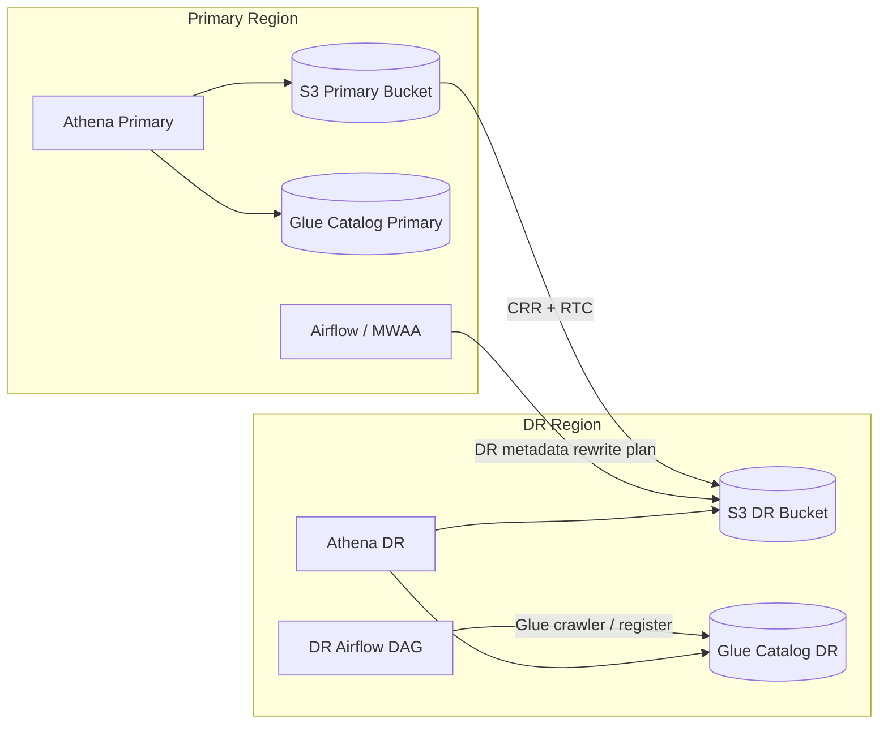

### 11.4 S3 replication rules

1. Enable versioning on primary and DR buckets.
2. Enable SSE-KMS; prod 與 DR 使用 region-local KMS key 或 multi-region key。
3. Enable CRR from primary to DR for:
   - `warehouse/bronze/`
   - `warehouse/silver/`
   - `warehouse/gold/`
   - `warehouse/cache/`
4. Enable S3 RTC for critical `gold/` and `cache/` prefixes。
5. Exclude Athena query result bucket unless required。
6. Enable replication metrics and failure notifications。
7. Use S3 Batch Replication for initial backfill。

### 11.5 DR metadata path rewrite

建議 Airflow 每次 Gold/Cache build 後執行 DR sync DAG：

```text
For each critical table:
1. 找出最新 primary metadata file。
2. 執行 Iceberg rewrite_table_path：
   source_prefix = s3://company-lakehouse-prod-usw2/warehouse/<ns>/<table>
   target_prefix = s3://company-lakehouse-prod-use1-dr/warehouse/<ns>/<table>
3. 產生 rewritten metadata 到 staging prefix。
4. 確認 copy plan 中所有 data files 已 replication complete。
5. 將 rewritten metadata 放到 DR table metadata prefix。
6. 在 DR Glue catalog 註冊 / 更新該 table 的 latest metadata file location。
7. 跑 Athena DR smoke query。
```

Spark procedure 範例：

```sql
CALL prod_catalog.system.rewrite_table_path(
    table => 'gold.fact_metric_day_wide',
    source_prefix => 's3://company-lakehouse-prod-usw2/warehouse/gold/fact_metric_day_wide',
    target_prefix => 's3://company-lakehouse-prod-use1-dr/warehouse/gold/fact_metric_day_wide',
    staging_location => 's3://company-lakehouse-prod-use1-dr/warehouse/_dr_staging/gold/fact_metric_day_wide'
);
```

### 11.6 Glue DR catalog

DR region 需要獨立 Glue database：

```text
bronze_dr
silver_dr
gold_dr
cache_dr
```

或與 primary 同名 database，但在 DR account/region 中隔離。

Catalog promote strategy：

```text
Option A: Glue Crawler reads DR table paths and updates latest metadata location.
Option B: Glue API directly updates Iceberg table metadata_location.
Option C: Spark register_table registers rewritten metadata file.
```

建議 MVP 使用 Glue Crawler；成熟後改 Glue API / Spark register_table，減少 crawler 掃描時間。

### 11.7 MRAP 使用限制

S3 Multi-Region Access Point 可提供 global endpoint 與 failover control，但它不會自動保證所有 bucket 都有相同物件；若 request 被路由到沒有該 object 的 bucket 可能得到 404。因此 MRAP 必須搭配 CRR，且 MRAP 不會自動解決 Iceberg metadata 中絕對路徑問題。

本設計不依賴 MRAP 讓 Iceberg table 自動 multi-region active-active；MRAP 僅可作為 read endpoint / failover endpoint 的選配。

### 11.8 S3 Tables replication 選項

如果未來採用 Amazon S3 Tables，S3 Tables replication 可建立 read-only Iceberg replicas，維持資料、metadata、snapshot history 與一致順序。此方案可大幅減少自建 path rewrite 的複雜度，但需驗證：

1. dbt-athena 對 S3 Tables / table buckets 的支援程度。
2. Glue Catalog 與 Athena query path。
3. 現有 governance / Lake Formation policy。
4. 是否接受 DR replica read-only。

建議列為 Phase 2 POC，不列為 MVP 前提。

---

## 12. Platform Adapter Layer

### 12.1 dbt macro 規範

Model SQL 禁止：

```jinja

```

所有差異必須透過 dispatch：

```sql

  {{ return(adapter.dispatch('platform_iceberg_table_type', 'platform')()) }}



  {{ return('iceberg') }}



  {{ return('iceberg') }}

```

### 12.2 dbt profiles

`profiles.yml.example`

```yaml
lakehouse:
  target: local-trino
  outputs:
    local-trino:
      type: trino
      method: none
      host: trino.lakehouse.svc.cluster.local
      port: 8080
      user: local
      catalog: iceberg
      schema: gold
      threads: 4

    prod-athena:
      type: athena
      s3_staging_dir: s3://company-athena-query-results-usw2/dbt/
      region_name: us-west-2
      database: gold
      schema: gold
      work_group: analytics-prod
      threads: 8
```

### 12.3 SQL compatibility lint

禁止 function / syntax：

```text
- 任意 engine-specific UDF（hash 函數除外，見下方白名單）
- SELECT * in Gold/Cache
- information_schema in BI-facing models
- CREATE TABLE AS outside dbt materialization
- non-deterministic hash key generation（禁止使用 random()、uuid()、current_timestamp 作為 surrogate key）
- timestamp precision > millisecond in Prod-bound models
- string columns in fact models
- 直接呼叫 md5()/xxhash64() 而不透過 stable_hash64_number macro
```

Hash function 白名單（Trino + Athena v3 同步支援）：

```text
- xxhash64(varbinary)      → 64-bit hash，透過 stable_hash64_number macro 使用
- from_big_endian_64(varbinary) → varbinary 轉 BIGINT
- bitwise_and(bigint, bigint)   → 清除符號位
- to_utf8(varchar)         → string 轉 varbinary
- md5(varbinary)           → 僅允許 v2 fallback 期間使用
```

Athena engine version 要求：

```text
prod-athena workgroup 必須設定 EngineVersion = Athena engine version 3
禁止使用 engine v2（不支援 xxhash64，且 end-of-life 風險）
```

CI rule：

```bash
# 禁止 model 層出現 target.type 分支
grep -R "target.type" dbt/models dbt/snapshots dbt/macros/tests && exit 1

# 禁止 model 層直接呼叫 hash 原語（必須透過 macro）
grep -R "xxhash64\|md5(" dbt/models && exit 1

# Compiled SQL 相容性驗證（同時掃 local 與 prod 兩份 compile 結果）
dbt compile --target local-trino --no-partial-parse
mv target/compiled target_local_compiled
dbt compile --target prod-athena --no-partial-parse
mv target/compiled target_prod_compiled
python platform/validate_sql_compatibility.py target_local_compiled --engine trino
python platform/validate_sql_compatibility.py target_prod_compiled --engine athena

# MySQL target compile + SQL compatibility lint
dbt compile --target mysql-cache --no-partial-parse
mv target/compiled target_mysql_compiled
python platform/validate_sql_compatibility.py target_mysql_compiled --engine mysql
# MySQL lint 重點：禁止出現 xxhash64/from_big_endian_64/DATE_DIFF/DATE_TRUNC 等 Trino/Athena 函數
# 允許出現 TIMESTAMPDIFF/DATE_SUB/DATE_FORMAT 等 MySQL 原生函數

# Hash function smoke test（Trino 與 Athena 輸出必須完全一致）
python platform/smoke_hash_function.py \
  --trino-target local-trino \
  --athena-target prod-athena \
  --input "order|RM12345"
```

### 12.4 Catalog promote

`catalog_promote.py` 負責：

```text
1. 讀取 contracts/tables/*.yml
2. 比對 local table contract 與 dbt manifest
3. 產生 prod Glue database/table/crawler config
4. 執行 Glue crawler 或 Glue API update
5. 驗證 latest metadata location
6. 執行 Athena smoke query
7. 寫入 audit.catalog_promotion_log
```

Pseudo-code：

```python
def promote_table(contract):
    validate_contract(contract)
    if contract.layer in ['bronze', 'silver', 'gold', 'cache']:
        ensure_glue_database(contract.namespace)
        ensure_glue_crawler_or_table(contract)
        run_glue_crawler(contract)
        wait_until_crawler_succeeded(contract)
        validate_glue_schema(contract)
        run_athena_smoke_query(contract)
        write_audit_log(contract, status='success')
```

---

## 13. Airflow DAG 設計

### 13.1 DAG 列表

| DAG | 頻率 | 用途 |
|---|---:|---|
| `lakehouse_ingest` | hourly / daily | OLTP/API/file -> Bronze |
| `lakehouse_transform` | hourly | Bronze -> Silver -> Gold long/wide/day/month |
| `lakehouse_cache_refresh` | hourly | Gold -> Athena Cache / MV-equivalent |
| `lakehouse_mysql_cache` | daily | MySQL OLTP -> MySQL Gold Cache（滾動 730 天）+ RANGE PARTITION daily rotation |
| `lakehouse_catalog_promote` | on deploy / hourly | Prod Glue registration/crawler |
| `lakehouse_maintenance` | daily/weekly | optimize/vacuum/expire snapshots |
| `lakehouse_dr_sync` | hourly | S3 replication validation + metadata rewrite + DR Glue update |
| `lakehouse_dq` | hourly/daily | dbt tests + custom assertions |
| `lakehouse_backfill` | manual | 指定時間範圍重算 |

### 13.2 Main transform DAG（Athena）

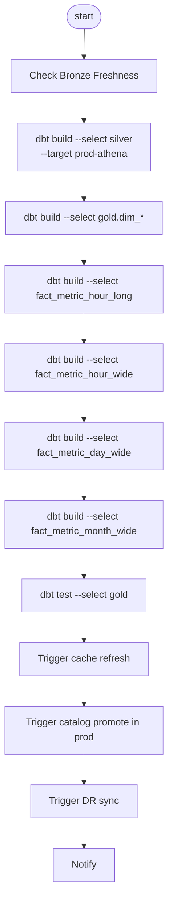

### 13.2b MySQL Cache DAG（Hot Tier 每日更新）

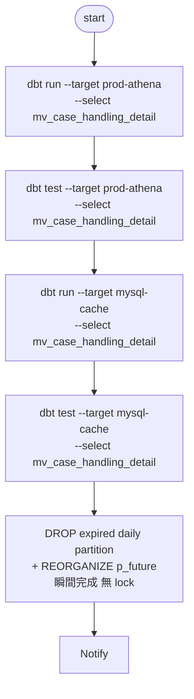

```python
# dags/lakehouse_mysql_cache.py（關鍵片段）
athena_run = BashOperator(
    task_id="dbt_athena_run",
    bash_command="dbt run --select mv_case_handling_detail --target prod-athena"
)
athena_test = BashOperator(
    task_id="dbt_athena_test",
    bash_command="dbt test --select mv_case_handling_detail --target prod-athena"
)
mysql_run = BashOperator(
    task_id="dbt_mysql_run",
    bash_command="dbt run --select mv_case_handling_detail --target mysql-cache"
)
mysql_test = BashOperator(
    task_id="dbt_mysql_test",
    bash_command="dbt test --select mv_case_handling_detail --target mysql-cache"
)
# DROP PARTITION（metadata 操作，瞬間完成，無 InnoDB gap lock）
# 不使用 row-level DELETE：7300 萬筆 DELETE 會長時間持鎖阻塞查詢
mysql_rotation = PythonOperator(
    task_id="mysql_partition_rotation",
    python_callable=rotate_mysql_daily_partition,
    op_kwargs={
        "host":         "{{ var('mysql_cache_host') }}",
        "db":           "cache_gold",
        "table":        "mv_case_handling_detail",
        "retain_days":  730,
        "buffer_days":  30,
    }
)

athena_run >> athena_test >> mysql_run >> mysql_test >> mysql_rotation
```

> **排程依賴**：`mysql_rotation` 必須排在 `mysql_run` 之後（確保當日資料已寫入後才切 partition）。若啟用每小時模式，`mysql_rotation` 排程應早於當日第一次 `mysql_run`（建議 00:00），確保當日 daily partition 已切好，避免資料暫落 p_future 後被 REORGANIZE 重建。
>
> Athena 先跑：保證 Athena Gold 為 source of truth，且若 Athena 失敗，MySQL 不會拿到舊資料去覆蓋。MySQL run 失敗不阻斷主 DAG，但需告警。

### 13.3 Airflow variables

```json
{
  "platform": "local-trino | prod-athena",
  "dbt_target": "local-trino | prod-athena",
  "rebuild_from_date": "2026-05-01",
  "warehouse_primary": "s3://company-lakehouse-prod-usw2/warehouse",
  "warehouse_dr": "s3://company-lakehouse-prod-use1-dr/warehouse",
  "enable_dr_sync": true,
  "enable_cache_refresh": true,
  "enable_catalog_promote": true,
  "enable_mysql_cache": true,
  "mysql_cache_retention_days": 730,
  "mysql_cache_buffer_days": 30,
  "mysql_cache_lookback_hours": 26,
  "mysql_cache_hourly_mode": false
}
```

---

## 14. Step-by-Step 落地計畫

## Phase 0：前置決策

1. 決定 AWS region：primary / DR。
2. 決定 bucket names。
3. 決定 catalog source-of-truth：Git contracts。
4. 決定 local stack：Rancher Desktop + Helm。
5. 決定 Prod orchestration：MWAA 或 Airflow on EKS。
6. 決定 USER cache 模式：Prod 使用 dbt Iceberg table，不依賴 Athena MV refresh。

驗收：`contracts/` 目錄存在，至少有 3 張表 contract。

## Phase 1：Local K8s 建置

### 1. 建 namespace

```bash
kubectl create namespace lakehouse
kubectl create namespace observability
```

### 2. 部署 MinIO

```bash
helm repo add minio https://charts.min.io/
helm repo update
helm upgrade --install minio minio/minio \
  --namespace lakehouse \
  -f k8s/local/minio-values.yaml
```

建立 bucket：

```bash
kubectl -n lakehouse port-forward svc/minio 9000:9000
mc alias set local http://localhost:9000 <MINIO_ROOT_USER> <MINIO_ROOT_PASSWORD>
mc mb local/lakehouse-local
mc version enable local/lakehouse-local
```

### 3. 部署 Polaris

```bash
helm repo add polaris https://downloads.apache.org/polaris/helm-chart
helm repo update
helm upgrade --install polaris polaris/polaris \
  --namespace lakehouse \
  -f k8s/local/polaris-values.yaml
```

設定 Polaris catalog allowed location：

```text
s3://lakehouse-local/warehouse
```

### 4. 部署 Trino

```bash
helm repo add trino https://trinodb.github.io/charts
helm repo update
helm upgrade --install trino trino/trino \
  --namespace lakehouse \
  -f k8s/local/trino-values.yaml
```

Trino Iceberg catalog 範例：

```properties
connector.name=iceberg
iceberg.catalog.type=rest
iceberg.rest-catalog.uri=http://polaris.lakehouse.svc.cluster.local:8181/api/catalog
iceberg.rest-catalog.warehouse=local
fs.native-s3.enabled=true
s3.endpoint=http://minio.lakehouse.svc.cluster.local:9000
s3.path-style-access=true
s3.aws-access-key=<MINIO_ROOT_USER>
s3.aws-secret-key=<MINIO_ROOT_PASSWORD>
```

### 5. 部署 Airflow

```bash
helm repo add apache-airflow https://airflow.apache.org
helm repo update
helm upgrade --install airflow apache-airflow/airflow \
  --namespace lakehouse \
  -f k8s/local/airflow-values.yaml
```

設定 dbt target：

```bash
kubectl -n lakehouse create secret generic airflow-dbt-env \
  --from-literal=DBT_TARGET=local-trino
```

### 6. 部署 Metabase

```bash
helm upgrade --install metabase oci://registry-1.docker.io/bitnamicharts/metabase \
  --namespace lakehouse \
  -f k8s/local/metabase-values.yaml
```

Metabase connection：

```text
Database type: Starburst / Trino-compatible
Host: trino.lakehouse.svc.cluster.local
Port: 8080
Catalog: iceberg
Schema: cache
```

驗收：

```sql
CREATE SCHEMA IF NOT EXISTS iceberg.bronze;
CREATE TABLE iceberg.bronze.smoke_test (id bigint, value varchar);
INSERT INTO iceberg.bronze.smoke_test VALUES (1, 'ok');
SELECT * FROM iceberg.bronze.smoke_test;
```

## Phase 2：dbt 骨架與 Local Build

1. 建立 dbt project。
2. 加入 `profiles.yml.example`。
3. 實作 platform macros。
4. 寫第一張 Bronze、Silver、Gold、Cache model。
5. 執行：

```bash
cd dbt
dbt deps
dbt parse --target local-trino
dbt build --target local-trino --select bronze silver gold cache
```

驗收：Metabase 可查 `cache.user_metric_day`。

## Phase 3：Prod AWS 基礎設施

1. 建立 S3 primary bucket。
2. 建立 S3 DR bucket。
3. 啟用 versioning。
4. 啟用 KMS encryption。
5. 設定 CRR + RTC。
6. 建立 Glue databases：`bronze`, `silver`, `gold`, `cache`。
7. 建立 Athena workgroup。
8. 建立 query result bucket。
9. 設定 MWAA / Airflow variables。

S3 bucket 建議：

```text
company-lakehouse-prod-usw2
company-lakehouse-prod-use1-dr
company-athena-query-results-usw2
company-athena-query-results-use1-dr
```

## Phase 4：Prod dbt-athena compile / first execution

```bash
cd dbt
dbt parse --target prod-athena
dbt compile --target prod-athena --select silver gold cache
```

在 staging/prod 透過 Airflow 執行：

```bash
dbt build --target prod-athena --select silver gold cache --vars '{rebuild_from_date: "2026-05-01"}'
```

## Phase 5：Glue Catalog Promotion

執行：

```bash
python platform/catalog_promote.py \
  --env prod \
  --contracts contracts/tables \
  --namespace gold
```

驗收：

```sql
SELECT count(*) FROM gold.fact_metric_day_wide;
SELECT count(*) FROM cache.user_metric_day;
```

## Phase 6：DR Sync

```bash
airflow dags trigger lakehouse_dr_sync \
  --conf '{"tables":["gold.fact_metric_day_wide","cache.user_metric_day"]}'
```

驗收：

```sql
-- In DR Athena workgroup
SELECT count(*) FROM cache_dr.user_metric_day;
```

---

## 15. CI/CD 設計

### 15.1 PR pipeline

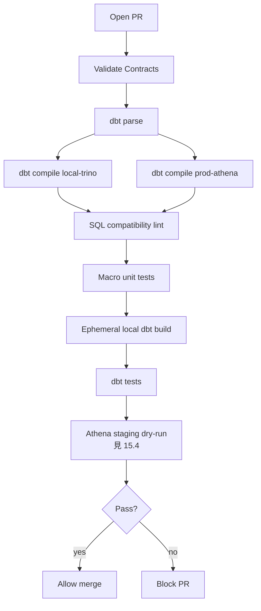

PR checks：

```bash
# 1. Contract validation（fast, no engine）
python platform/validate_contracts.py contracts/

# 2. Parse + dual compile（syntax only）
dbt parse --target local-trino
dbt compile --target local-trino
dbt compile --target prod-athena

# 3. Compatibility & type linters
python platform/validate_sql_compatibility.py target/compiled
python platform/validate_no_target_type.py dbt/models
python platform/validate_fact_numeric_only.py contracts/tables

# 4. Local ephemeral build（Trino）
dbt build --target local-trino --select state:modified+

# 5. Athena staging dry-run（實際引擎執行，見 15.4）
python platform/athena_staging_smoke.py \
  --target staging-athena \
  --select state:modified+ \
  --limit 100 \
  --workgroup ci-staging \
  --s3-output s3://lakehouse-ci/athena-staging-results/
```

### 15.2 Merge pipeline

```text
1. Build artifact: dbt project + Airflow DAG + contracts
2. Upload DAG/dbt artifact to MWAA S3 path
3. Run prod dbt build for modified models
4. Run catalog_promote.py
5. Run Athena smoke tests
6. Refresh cache tables
7. Run DR sync for critical tables
8. Notify Slack/Teams/Email
```

### 15.3 Nightly pipeline

```text
1. Full schema drift check
2. Hash collision check
3. Cache freshness check
4. Glue crawler health check
5. S3 replication lag check
6. Iceberg metadata health check
7. Cost report：Athena scanned bytes by workgroup / query tag
```

### 15.4 Athena Staging Smoke Test

#### 動機

`dbt compile --target prod-athena` 只驗證 Jinja macro 展開與 SQL 語法解析（在 Python process 內），**不執行任何 SQL**。Trino 與 Athena 雖然都基於 Presto，但存在以下差異：

| 差異點 | Trino（local） | Athena（prod） |
|---|---|---|
| `try_cast` 語法 | 支援 | 部分版本不支援，需用 `try()` |
| `date_add` 函數簽名 | `date_add('day', N, date)` | 同上，但 interval 字串大小寫敏感 |
| Iceberg metadata 函數 | Trino REST catalog | Glue Data Catalog |
| `unnest` 行為 | 標準 | 部分複雜 unnest 不支援 |
| 分區 schema | Polaris REST | Glue partition projection |

因此 PR pipeline 必須在真實 Athena engine 執行 `LIMIT 100` dry-run 確認 runtime 相容性，而不能只靠 compile。

#### 實作：athena_staging_smoke.py

```python
# platform/athena_staging_smoke.py（設計規格）
# 執行流程：
# 1. 讀取 dbt manifest.json 找出 state:modified 的 model 清單
# 2. 讀取 target/compiled/<model>.sql（prod-athena 版本）
# 3. 注入 LIMIT 100 wrapper：SELECT * FROM (<original>) t LIMIT 100
# 4. 對每個 model 送出 Athena StartQueryExecution
#    - Workgroup: ci-staging（獨立 cost 追蹤）
#    - OutputLocation: s3://lakehouse-ci/athena-staging-results/
# 5. 輪詢執行結果（最多等 300 秒）
# 6. 收集所有失敗的 model；失敗則 exit(1) 並列出 Athena query ID 供追查
# 7. 成功後清理 S3 output（cost 控制）
```

```bash
# 實際呼叫（已整合到 PR checks step 5）
python platform/athena_staging_smoke.py \
  --manifest target/manifest.json \
  --compiled-dir target/compiled \
  --target staging-athena \
  --workgroup ci-staging \
  --s3-output s3://lakehouse-ci/athena-staging-results/ \
  --timeout 300 \
  --max-concurrent 5
```

#### cost 控制

| 控制措施 | 做法 |
|---|---|
| 獨立 workgroup | `ci-staging` workgroup 設定 per-query 掃描上限 1 GB |
| LIMIT wrapper | 每個 query 最多回傳 100 行；Athena 遇到 LIMIT 後停止掃描 |
| 自動清理 S3 | 腳本執行完成後 delete s3://lakehouse-ci/athena-staging-results/$PR_ID/ |
| 只跑 modified | 用 dbt state:modified+ 限制執行範圍，不跑全量 |
| 費用告警 | AWS Budget 對 ci-staging workgroup 設 $50/月 告警 |

#### 預期輸出

```text
Athena staging smoke test
  PR #142, modified models: 4
  Running: fact_metric_hour_long, fact_metric_hour_wide, fact_metric_day_wide, slv_problem_event
  [OK]  fact_metric_hour_long   2.3s  scanned 12 MB  QID=abc123
  [OK]  fact_metric_hour_wide   1.8s  scanned  8 MB  QID=def456
  [FAIL] fact_metric_day_wide  ERROR: Function 'date_add' not registered  QID=ghi789
  [OK]  slv_problem_event       0.9s  scanned  4 MB  QID=jkl012
  1 model(s) failed. See Athena QID ghi789 for details.
  Exit code: 1
```

---

## 16. Runbook

## 16.1 Local startup

```bash
rancher-desktop start
kubectl config use-context rancher-desktop
kubectl create namespace lakehouse || true
helm upgrade --install minio ...
helm upgrade --install polaris ...
helm upgrade --install trino ...
helm upgrade --install airflow ...
helm upgrade --install metabase ...
```

Smoke test：

```bash
kubectl -n lakehouse port-forward svc/trino 8080:8080
trino --server localhost:8080 --catalog iceberg --schema bronze
```

```sql
SHOW SCHEMAS;
SHOW TABLES FROM bronze;
```

## 16.2 Local dbt build

```bash
cd dbt
dbt deps
dbt seed --target local-trino
dbt build --target local-trino --select bronze silver gold cache
```

故障排查：

| 症狀 | 處理 |
|---|---|
| Trino 連不到 MinIO | 檢查 `s3.endpoint`、path-style access、service DNS |
| Trino 連不到 Polaris | 檢查 Polaris service、REST URI、token/auth |
| dbt relation not found | 先跑 upstream model，檢查 catalog/schema |
| Iceberg commit failure | 檢查 object storage write permission / catalog auth |

## 16.3 新增 source table

1. 新增 `contracts/tables/bronze.<source>.yml`。
2. 新增 `models/bronze/bronze_<source>.sql`。
3. 新增 `models/silver/silver_<source>.sql`。
4. 若為 dimension，新增 snapshot。
5. 若產生 metric，更新 `field_registry.yml`。
6. 跑：

```bash
dbt build --target local-trino --select bronze_<source> silver_<source>+
python platform/generate_pivot_models.py \
  --field-registry contracts/metrics/field_registry.yml \
  --namespace-registry contracts/metrics/namespace_registry.yml
```

7. PR 通過 dual compile。
8. Merge 後 Airflow prod deploy。

## 16.4 新增 metric field

1. 在 `contracts/metrics/field_registry.yml` 新增 field。
2. 執行 generator：

```bash
python platform/generate_pivot_models.py \
  --field-registry contracts/metrics/field_registry.yml \
  --namespace-registry contracts/metrics/namespace_registry.yml \
  --output dbt/models/gold/generated
```

3. 更新 `gold.dim_field` seed/model。
4. 跑 local：

```bash
dbt build --target local-trino --select dim_field fact_metric_hour_long fact_metric_hour_wide fact_metric_day_wide fact_metric_month_wide cache
```

5. 跑 collision check：

```bash
python platform/validate_hash_collisions.py --target local-trino
```

## 16.5 Backfill hour/day/month

指定時間範圍：

```bash
airflow dags trigger lakehouse_backfill \
  --conf '{
    "from_date": "2026-05-01",
    "to_date": "2026-05-12",
    "models": ["fact_metric_hour_long", "fact_metric_hour_wide", "fact_metric_day_wide", "fact_metric_month_wide", "cache"]
  }'
```

Backfill 順序：

```text
1. Silver source range rebuild
2. fact_metric_hour_long merge
3. fact_metric_hour_wide rebuild affected dates
4. fact_metric_day_wide rebuild affected days
5. fact_metric_month_wide rebuild affected months
6. cache rebuild affected periods
7. dbt tests
8. Metabase smoke query
```

## 16.6 Hash collision incident

偵測 SQL：

```sql
select
  customer_sk,
  count(distinct customer_natural_key) as cnt
from gold.dim_customer
where is_current = 1
group by 1
having count(distinct customer_natural_key) > 1;
```

處理：

```text
1. 停止 affected model downstream DAG。
2. 將 collision key 寫入 audit.hash_collision_incidents。
3. 對該 dimension 切換到 managed surrogate key mapping table。
4. 重建 impacted dimensions。
5. 重建 impacted fact tables。
6. 重新整理 cache。
7. 通知 BI owner。
```

## 16.7 Cache stale incident

偵測：

```sql
select max(updated_at_sk) from cache.user_metric_day;
```

處理：

```text
1. 檢查 lakehouse_cache_refresh DAG 最近一次 run。
2. 若上游 Gold 成功，重跑 cache refresh。
3. 若上游 Gold 失敗，重跑 gold affected models。
4. 若 Athena query timeout，降低 refresh range 或分批跑。
5. 重新跑 Metabase smoke query。
```

## 16.8 Glue catalog promotion failure

處理：

```text
1. 檢查 Glue crawler status / error message。
2. 檢查 S3 table metadata path 是否存在。
3. 檢查 latest metadata file 是否已複製完成。
4. 執行 Athena DESCRIBE table。
5. 若 schema mismatch，執行 schema drift report。
6. 需要時 rollback 到上一個 Iceberg snapshot / metadata file。
```

## 16.9 S3 replication lag incident

監控：

```text
- BytesPendingReplication
- OperationsPendingReplication
- ReplicationLatency
- OperationsFailedReplication
```

處理：

```text
1. 暫停 DR catalog promotion。
2. 確認 replication IAM role / KMS permission。
3. 檢查 S3 RTC metrics。
4. 若 lag 超過 RPO，標記 DR stale。
5. 延後 failover，或接受資料落後並記錄 business approval。
```

## 16.10 DR failover

觸發條件：

```text
- Primary region S3 / Athena / Glue 不可用
- Business owner 宣告進入 DR
- SRE on-call approve
```

步驟：

```text
1. Freeze primary writes：暫停 ingestion / transform / cache DAG。
2. Check replication：確認 critical prefixes replication pending = 0 或取得 business approval。
3. Run DR metadata rewrite：對 critical tables 執行 rewrite_table_path。
4. Register DR Glue：更新 DR Glue latest metadata location。
5. Run Athena DR smoke queries。
6. Switch Metabase connection to DR Athena workgroup。
7. Enable read-only mode for dashboards。
8. Notify users：DR mode active，標記資料時間點。
```

Athena smoke：

```sql
select count(*) from cache_dr.user_metric_day;
select max(date_sk) from cache_dr.user_metric_day;
```

## 16.11 DR failback

```text
1. 確認 primary 恢復。
2. Freeze DR writes（本設計 DR 預設 read-only）。
3. 比對 primary/DR latest snapshot。
4. 若 DR 有新資料，規劃 reverse replication / manual merge。
5. 恢復 primary DAG。
6. 重新跑 primary cache refresh。
7. 切回 Metabase primary。
8. 保留 DR incident report。
```

---

## 17. Data Quality 與測試規範

### 17.1 Bronze tests

```text
- row_count > 0 for expected batch
- _ingested_at not null
- _source_system not null
- _batch_id not null
- raw duplicate rate within threshold
```

### 17.2 Silver tests

```text
- primary key unique
- type cast success rate >= threshold
- no invalid date
- no negative amount unless business allowed
- CDC dedup latest row only
```

### 17.3 Gold tests

```text
- fact tables type-compliant（entity/field SK = BIGINT、date_sk = DATE、hour = INT 0-23）
- dim FK relationship tests
- field_sk exists in dim_field
- date_sk exists in dim_date
- hour between 0 and 23
- fact grain unique
- metric aggregation reconciles with source
```

### 17.4 Cache tests

```text
- cache freshness within SLA
- row count within expected range
- dashboard smoke query passes
- query scan size under threshold
```

### 17.5 DR tests

```text
- replication pending metrics within SLA
- DR Glue table exists
- DR Athena smoke query passes
- DR latest date_sk within RPO
```

---

## 18. Observability

### 18.1 Metrics

| Metric | Source | Alert |
|---|---|---|
| Airflow DAG failure | Airflow | immediate |
| dbt model failure | Airflow/dbt artifacts | immediate |
| Athena query failure rate | CloudWatch/Athena | >5% |
| Athena scanned bytes | Athena | cost anomaly |
| Glue crawler failure | Glue | immediate |
| S3 replication pending bytes | CloudWatch S3 | > threshold |
| Cache max staleness | SQL check | > SLA |
| Hash collision count | SQL check | >0 |
| Iceberg small files count | metadata table | > threshold |

### 18.2 Audit tables

```text
audit.pipeline_run_log
audit.catalog_promotion_log
audit.cache_refresh_log
audit.dr_sync_log
audit.hash_collision_incidents
audit.schema_drift_log
```

---

## 19. Security / Governance

### 19.1 Local

Local 僅開發用途：

```text
- MinIO credentials 放 Kubernetes Secret
- Polaris internal auth or OIDC optional
- Trino auth local simplified
- 測試資料需脫敏
```

### 19.2 Prod

```text
- S3 bucket policy 最小權限
- SSE-KMS encryption
- Athena workgroup enforced query result location
- Glue Data Catalog permissions
- Lake Formation fine-grained access control for user-facing tables
- Metabase 使用 read-only IAM role / Athena workgroup
```

### 19.3 PII

詳細設計見 §9.3。安全摘要：

```text
Bronze: 原始 PII 不落地；ingestion 端完成 mask(_masked) + pii_hash(_pk)
Silver: 繼承 Bronze 轉換後欄位，不做二次處理
Gold DIM: 只放 _masked（展示用）；Fact 只放 _pk（JOIN 用）
Cache: 無 PII；如有展示需求僅接受 Gold DIM 的 _masked，且需明確授權
存取: Bronze raw → restricted role; Silver+ → analyst role; Cache → bi_reader
```

---

## 20. Performance / Cost

### 20.1 Iceberg table optimization

```text
- target file size: 256MB-512MB
- Bronze 可較小，Gold/Cache 應壓大檔
- partition: day(event_ts) + optional bucket(entity_sk)
- 禁止 user_id/customer_id 直接 partition
- 定期 expire snapshots
- 定期 remove orphan files
- 定期 optimize / rewrite data files
```

### 20.2 Athena 成本控制

```text
- Metabase 只能查 cache/gold，不查 bronze/silver
- cache tables 按 date/month partition
- Athena workgroup 設 query scan limit
- 每個 dashboard 查詢加 date filter
- 避免 SELECT *
```

### 20.3 Local 成本 / 資源

Rancher Desktop 建議：

```text
CPU: 6-8 cores
Memory: 16-24GB
Disk: 80GB+
```

Local services：

```text
MinIO: 1-2GB
Polaris: 1-2GB
Trino coordinator: 2-4GB
Trino worker: 4GB
Airflow: 2-4GB
Metabase: 1-2GB
Postgres: 1GB
```

---

## 21. 主要風險與緩解

| 風險 | 嚴重度 | 緩解 |
|---|---:|---|
| Local Trino SQL 在 Athena 不通 | 高 | dual compile + Athena smoke + macro dispatch |
| Glue catalog 與 Polaris metadata 差異 | 高 | contract-first + catalog_promote + schema diff |
| S3 CRR 後 Iceberg metadata path 仍指 primary | 高 | rewrite_table_path + DR Glue registration |
| Athena 無法 create/refresh MV | 中 | Prod 使用 dbt cache table；Athena 只 read |
| Hash collision | 中 | 60-bit hash + collision tests；核心 dim 改 mapping table |
| BI 查詢掃太多資料 | 中 | cache tables + workgroup scan limit + dashboard lint |
| Airflow/MWAA package drift | 中 | pin requirements + local MWAA-like image |
| S3 replication lag | 高 | S3 RTC metrics + DR stale flag + failover approval |
| Schema drift | 高 | contract validation + dbt tests + Glue schema diff |

---

## 22. 最終建議

本方案可以落地，但必須用正確名字管理期待：

```text
Contract-first Portable Lakehouse
```

而不是：

```text
100% Local/Prod Isomorphic Lakehouse
```

最重要的工程紀律：

1. 所有 table / metric / policy 都由 Git contract 定義。
2. 所有 SQL 差異都在 dbt macro，不在 model 裡分支。
3. Gold fact 嚴格全數字化，字串屬性全部進 dim。
4. Hour long fact 是 canonical source；hour/day/month wide fact 是 serving/pivot layer。
5. USER 端查 cache，不直接查 long fact。
6. Prod cache 用 dbt-managed Iceberg table，不依賴 Athena refresh MV。
7. S3 dual-location 需要 object replication + Iceberg path rewrite + DR catalog registration，不能只靠 CRR。
8. 每次部署必須 dual compile、schema diff、Athena smoke、cache freshness、DR sync check。

---

## 23. MVP Scope

第一版只做以下內容：

```text
1. Local Rancher Desktop stack：MinIO + Polaris + Trino + Airflow + Metabase
2. 一個 OLTP source：orders
3. Bronze：bronze_orders
4. Silver：silver_orders
5. Dim：dim_date, dim_time, dim_field, dim_customer
6. Gold：fact_metric_hour_long, fact_metric_hour_wide, fact_metric_day_wide, fact_metric_month_wide
7. Cache：cache.user_metric_day
8. Prod：dbt-athena compile + single table Athena execution
9. Glue：crawler/register cache.user_metric_day
10. DR：S3 CRR + one critical table metadata rewrite POC
```

MVP 驗收：

```text
Local:
- dbt build local-trino 成功
- Metabase 查 cache.user_metric_day 成功

Prod:
- dbt compile prod-athena 成功
- dbt build prod-athena 建出 cache.user_metric_day
- Athena 查 cache.user_metric_day 成功

DR:
- S3 object replication 完成
- DR Glue table 可查
- DR Athena count(*) 成功
```

---

## 24. 附錄 A：新增指標完整流程

例：新增 `refund_amount`。

1. 更新 `field_registry.yml`：

```yaml
- field_code: refund_amount
  field_name: Refund Amount
  field_type: metric
  value_type: decimal
  aggregation:
    hour_to_day: sum
    day_to_month: sum
  default_value: 0
  expose_to_bi: true
```

2. 更新 Silver source logic，產生 refund metric row。
3. `generate_pivot_models.py` 產生 hour/day/month wide SQL。
4. 更新 `dim_field`。
5. local build：

```bash
dbt build --target local-trino --select dim_field fact_metric_hour_long fact_metric_hour_wide fact_metric_day_wide fact_metric_month_wide cache
```

6. 檢查 Metabase。
7. PR dual compile。
8. Prod deploy。
9. Run catalog promote。
10. Run cache refresh。

---

## 25. 附錄 B：資料流範例

### 25.1 OLTP row

```text
orders:
order_id = O1001
customer_id = C900
order_ts = 2026-05-12 13:15:00
amount = 5023.75
```

### 25.2 Bronze

```text
bronze_orders:
order_id='O1001'
customer_id='C900'
order_ts='2026-05-12 13:15:00'
amount_raw='5023.75'
_ingested_at='2026-05-12 13:20:00'
```

### 25.3 Silver

```text
silver_orders:
order_sk=hash('order|O1001')
customer_sk=hash('customer|C900')
order_ts=timestamp '2026-05-12 13:15:00'
amount=decimal(18,2) 5023.75
```

### 25.4 Gold long

```text
fact_metric_hour_long:
date_sk=2026-05-12
hour=13
month_sk=202605
entity_sk=hash('customer|C900')
field_sk=hash('field|revenue_amount')
value_decimal=5023.75
```

另一列：

```text
date_sk=2026-05-12
hour=13
entity_sk=hash('customer|C900')
field_sk=hash('field|orders_count')
value_decimal=1
```

### 25.5 Gold hour wide

```text
fact_metric_hour_wide:
date_sk=2026-05-12
hour=13
entity_sk=hash('customer|C900')
orders_count=1
revenue_amount=5023.75
```

### 25.6 Gold day wide

```text
fact_metric_day_wide:
date_sk=2026-05-12
entity_sk=hash('customer|C900')
orders_count=sum(hour.orders_count)
revenue_amount=sum(hour.revenue_amount)
```

### 25.7 USER cache

```text
cache.user_metric_day:
calendar_date=2026-05-12
customer_name='Acme Corp'
orders_count=1
revenue_amount=5023.75
```

USER / Metabase 查 cache，不需要知道 hash key 與 EAV long fact。

---

## 26. 附錄 C：Mermaid ERD

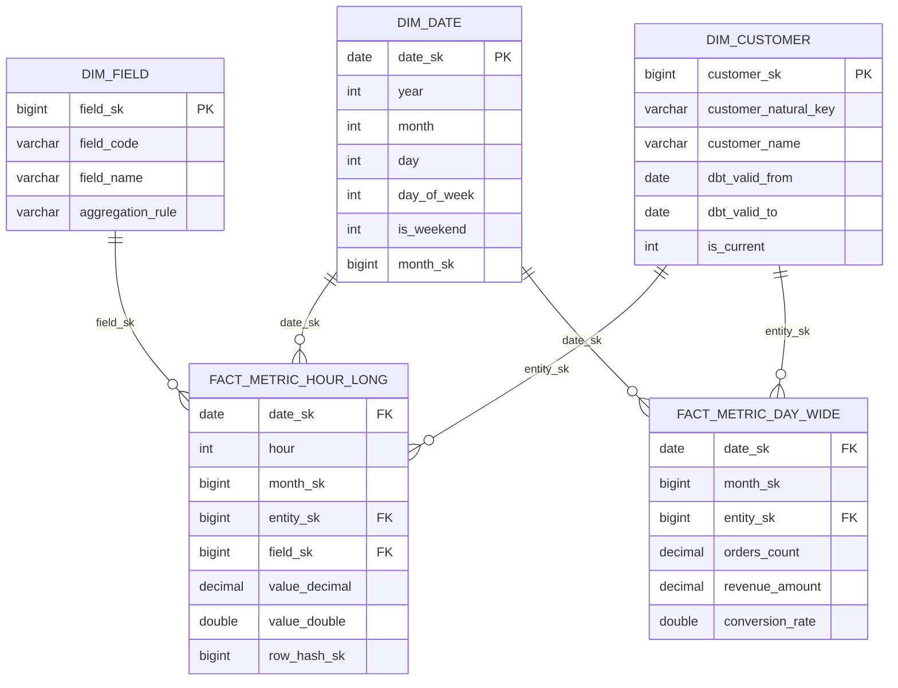

---

## 27. 附錄 D：決策紀錄 ADR

### ADR-001：採用 Portable 而非 Full Isomorphic

決策：Local 與 Prod 使用不同 query/catalog stack，但透過 contract + adapters 自動化。

理由：Prod 需要 Athena/Glue 的 managed convenience；Local 需要離線 K8s dev stack。

後果：需要維護 platform adapter layer。

### ADR-002：Gold canonical fact 使用 hour long EAV/narrow

決策：`fact_metric_hour_long(date_sk DATE, hour INT, entity_sk BIGINT, field_sk BIGINT, value)` 作為 canonical metric fact。

理由：支持動態 field/metric，不需頻繁改 schema。

後果：BI 不直接查 long fact，必須 pivot 成 wide/cache。

### ADR-003：Prod cache 使用 dbt table，不依賴 Athena MV refresh

決策：Prod cache 由 dbt-athena 建 Iceberg table。

理由：Athena 可以查 Glue Data Catalog MVs，但不支援 create/refresh/drop/modify MV。

後果：local Trino MV 與 prod dbt table 不完全同形，但由 macro 隱藏。

### ADR-004：S3 dual-location 使用 CRR + rewrite_table_path

決策：CRR 複製 object；Iceberg metadata path rewrite 產生 DR 可查 table；DR Glue catalog register。

理由：單純 CRR 不能保證 Iceberg metadata 指向 DR bucket。

後果：DR sync DAG 需要維護。

### ADR-005：EAV Narrow Fact + Incremental Pivot + UNION ALL 日報表策略

決策：Gold canonical fact 採用 `(date_sk, hour, entity_sk, field_sk, value)` EAV narrow 格式；pivot 成 wide 為 dbt incremental model；日報表 view 以 UNION ALL 合併 day_wide（D-1 以前）與 hour_wide SUM（D+0 intraday）。

理由：
1. **動態欄位**：業務指標頻繁新增；EAV 模式零 DDL 擴展，field_registry.yml 驅動，符合 dbt MetricFlow 語意層設計理念（dbt Labs, 2023）。
2. **原子性保證**：Silver 原子行確保 narrow fact 每一列均為可稽核的最小計量單位；pivot 只是展示層變換，不改變業務語意。
3. **1-hour SLA**：Lambda Architecture（Nathan Marz, 2011）在 serving 層的直接應用。day_wide 為批次層（延遲 = 0），hour_wide SUM 為速度層（延遲 ≤ pipeline lag ≈ 15 min）；UNION ALL 合併後最大延遲 < 1 小時。
4. **GA4 / Segment 驗證**：Google Analytics 4、Segment 皆以 EAV narrow event 為 canonical fact，pivot 在 serving 層；是百億行規模驗證過的模式。

後果：
- BI 不能直查 `fact_metric_hour_long`，必須透過 wide / cache 層。
- 比率指標（conversion_rate 等）在 UNION ALL 速度層需加權平均計算，不可直接 SUM。
- 新增指標需同步更新 `field_registry.yml` 與 pivot model 的 `CASE WHEN` 欄位清單。

---

## 28. References

### 資料倉儲設計理論

- Kimball, R. & Ross, M. (2013). _The Data Warehouse Toolkit: The Definitive Guide to Dimensional Modeling_ (3rd ed.). Wiley. — Star schema, surrogate key, factless fact, accumulating snapshot 原始出處。
- Marz, N. & Warren, J. (2015). _Big Data: Principles and Best Practices of Scalable Realtime Data Systems_. Manning. — Lambda Architecture 批次層 + 速度層 + serving 層理論基礎。
- Schnider, D. (2015). Native DATE vs INTEGER Date Keys. _The Data Warehouse Insider_. — native DATE 型別對 optimizer cardinality 估算的優勢。
- dbt Labs, Connors, D. (2022). _The Metrics Layer_. — MetricFlow semantic layer 以 narrow grain measure 為基礎的設計原則；動態指標擴展模式。

### EAV Narrow Fact 業界實踐

- Google. (2020). _Google Analytics 4 BigQuery Export Schema_. — event + event_param EAV 模型，UNNEST + PIVOT 展開為寬表的 serving pattern。
- Segment. (2022). _Segment Connections: Event Schema Design_. — track event narrow 儲存，Connections 自動 pivot 成 warehouse wide table。
- Snowplow Analytics. (2021). _Snowplow Event Model_. — append-only narrow event fact，downstream transformations 產生寬表。
- Apache Software Foundation. (2023). _Apache Druid Architecture_. — real-time OLAP 以 narrow event 格式索引，動態 groupby 支援。

### 平台技術文件

- Apache Iceberg Spec: https://apache.github.io/iceberg/spec/
- Apache Iceberg Partitioning: https://iceberg.apache.org/docs/latest/partitioning/
- Apache Iceberg Spark Procedures / rewrite_table_path: https://iceberg.apache.org/docs/1.9.2/spark-procedures/#rewrite_table_path
- Trino Iceberg Connector: https://trino.io/docs/current/connector/iceberg.html
- Trino Blog (2023). _Iceberg Hidden Partitioning with DATE columns_. — native DATE 參與 hidden partition pruning；INTEGER date key 不參與 transform。
- Trino Binary Functions: https://trino.io/docs/current/functions/binary.html
- Trino Mathematical Functions: https://trino.io/docs/current/functions/math.html
- Apache Polaris Helm Chart: https://polaris.apache.org/releases/1.4.1/helm-chart/
- dbt dispatch: https://docs.getdbt.com/reference/dbt-jinja-functions/dispatch
- Databricks. (2022). _Lakehouse Surrogate Key Best Practices_. — BIGINT identity/hash 作為 lakehouse surrogate key 標準。
- dbt-athena Iceberg materialization: https://dbt-athena.github.io/docs/configuration/materializations/iceberg
- AWS Glue Iceberg Crawler announcement: https://aws.amazon.com/about-aws/whats-new/2023/07/aws-glue-crawlers-apache-iceberg-tables/
- AWS Glue transactional tables: https://docs.aws.amazon.com/glue/latest/dg/populate-otf.html
- Athena query Glue Data Catalog materialized views: https://docs.aws.amazon.com/athena/latest/ug/querying-iceberg-gdc-mv.html
- Athena create Iceberg tables: https://docs.aws.amazon.com/athena/latest/ug/querying-iceberg-creating-tables.html
- S3 Multi-Region Access Points: https://docs.aws.amazon.com/AmazonS3/latest/userguide/MultiRegionAccessPoints.html
- S3 MRAP replication considerations: https://docs.aws.amazon.com/AmazonS3/latest/userguide/MultiRegionAccessPointBucketReplication.html
- S3 Replication Time Control: https://docs.aws.amazon.com/AmazonS3/latest/userguide/replication-time-control.html
- S3 Tables replication: https://docs.aws.amazon.com/AmazonS3/latest/userguide/s3-tables-replication-how-replication-works.html


## 29. 附錄 E：實戰案例 — RPT_212 客服問題單日報（Bronze → MV 完整流程）

### E.1 案例背景

| 項目 | 說明 |
|---|---|
| 報表名稱 | RPT_212 客服問題單日報（購物信件回覆時效） |
| 核心痛點 | MSTR 77 個 Custom Group → 77 條 SQL × 17 LEFT JOIN VIEW 全表掃描 → Athena timeout |
| 目標 | 把 VIEW chain 轉成 Bronze → Silver → Gold EAV → Wide → Cache MV，MSTR 只查 cache |
| 業務粒度 | 每張問題單（prblm_code）為原子事件；報表按 小時/日/月 × 子站 × 客服大分類 × 業績歸屬區 彙總 |

**OLTP 來源表**：

| 表名 | 角色 | 關鍵欄位 |
|---|---|---|
| `fact_prblm_m` | 問題單主表（事實） | prblm_code, prblm_sysdate, catsub_id, quek_id, supplier_id, prblm_preassignenddate, prblm_donedate, prblm_status_id |
| `fact_answr` | 回覆記錄表（事實） | answr_prblmcode, answr_ts |
| `dim_prblm_faq_cn` | 客服大/小分類 | quek_id, queid, quename |
| `mv_sales_attribution_map` | 子站→業績歸屬區 | catsub_id（子站編號）, 業績歸屬區名稱 |
| `dim_prblm_status` | 問題狀態 | prblm_status_id, prblm_status_name |
| `mv_dim_problem_source` | 問題來源 | prblm_source_id, prblm_source_name |
| `dim_prblm_complain` | 客訴層級 | prblm_complain_id, prblm_complain_name |
| `dim_priuser_cn` | 結案人 | priuser_name, priuser_fullname |
| `dim_complainreason` | 客訴主因 | complainreason_code, complainreason_desc |
| `dim_prblm_notasowndept` | 權責單位 | prblm_notasowndept_id, prblm_notasowndept_name |

---

### E.2 一筆原始資料樣本

以下用一張真實問題單走完整個 pipeline，追蹤每一層的變形：

```text
OLTP 原始資料（fact_prblm_m）：
  prblm_code            = 'CS20250621-001'
  prblm_sysdate         = 2025-06-21 10:30:00
  prblm_blngcode        = 'RM12345'          -- RM 單號
  catsub_id             = 801                -- 子站：包包
  quek_id               = 49                 -- 客服大分類：購物信件
  queid                 = 4901               -- 客服小分類
  supplier_id           = 'SUP001'
  prblm_processuser     = 'agent_w'
  prblm_preassignenddate = 2025-06-21 13:45:00  -- 回覆截止時間
  prblm_donedate        = 2025-06-21 15:20:00   -- 結案時間
  prblm_doneatatime     = true                   -- 有結案
  prblm_status_id       = 2                  -- 已結案
  prblm_notasreason_id  = 0
  prblm_notasowndept_id = 10
```

---

### E.3 Bronze 銅表

**目的**：原封不動 append，保留原始 source truth。

```sql
-- models/bronze/brz_prblm_m.sql
{{ config(
    materialized='incremental',
    table_type='iceberg',
    incremental_strategy='append',
    partitioned_by=['day(_ingested_date)'],
    tags=['bronze']
) }}

select
    cast(prblm_code            as varchar)   as prblm_code,
    cast(prblm_sysdate         as timestamp) as prblm_sysdate,
    cast(prblm_blngcode        as varchar)   as prblm_blngcode,
    cast(catsub_id             as bigint)    as catsub_id,
    cast(quek_id               as bigint)    as quek_id,
    cast(queid                 as bigint)    as queid,
    cast(supplier_id           as varchar)   as supplier_id,
    cast(prblm_processuser     as varchar)   as prblm_processuser,
    cast(prblm_preassignenddate as timestamp) as prblm_preassignenddate,
    cast(prblm_donedate        as timestamp) as prblm_donedate,
    cast(prblm_doneatatime     as boolean)   as prblm_doneatatime,
    cast(prblm_status_id       as bigint)    as prblm_status_id,
    cast(prblm_notasowndept_id as bigint)    as prblm_notasowndept_id,
    cast(prblm_notasreason_id  as bigint)    as prblm_notasreason_id,
    current_timestamp                        as _ingested_at,
    current_date                             as _ingested_date,
    'oltp_cs'                                as _source_system,
    'fact_prblm_m'                           as _source_table
from {{ source('oltp_cs', 'fact_prblm_m') }}

where prblm_sysdate >= date_add('day', -1, current_date)

```

**Bronze 樣本資料**（原樣落地，僅加 metadata）：

| prblm_code | prblm_sysdate | catsub_id | quek_id | prblm_preassignenddate | prblm_donedate | _ingested_at |
|---|---|---|---|---|---|---|
| CS20250621-001 | 2025-06-21 10:30:00 | 801 | 49 | 2025-06-21 13:45:00 | 2025-06-21 15:20:00 | 2025-06-21 11:00:00 |
| CS20250621-002 | 2025-06-21 10:55:00 | 801 | 49 | 2025-06-21 18:55:00 | NULL | 2025-06-21 11:00:00 |
| CS20250621-003 | 2025-06-21 10:12:00 | 902 | 54 | 2025-06-21 14:12:00 | 2025-06-21 22:00:00 | 2025-06-21 11:00:00 |

---

### E.4 Silver 銀表（去重 + 原子行，無 SK）

**設計原則**：Silver 只做去重、型別修正、原子化、衍生業務指標。**SK 不在此層計算**，保留 natural key，空間最小。Gold 層讀取 Silver natural key，第一次進行 hash。

#### E.4a `slv_problem_event`（事實事件行）

```sql
-- models/silver/slv_problem_event.sql
{{ config(
    materialized='incremental',
    table_type='iceberg',
    incremental_strategy='merge',
    unique_key='prblm_code',       -- natural key；不用 hash SK
    partitioned_by=['day(event_date)'],
    tags=['silver']
) }}

select
    -- natural keys（保留，Gold 層才 hash）
    b.prblm_code,
    b.prblm_blngcode,
    cast(b.catsub_id         as varchar) as catsub_id,
    cast(b.quek_id           as varchar) as quek_id,
    cast(b.queid             as varchar) as queid,
    cast(b.prblm_status_id   as varchar) as prblm_status_id,
    b.supplier_id,

    -- time dimensions（DATE + hour INT）
    cast(b.prblm_sysdate as date)                              as event_date,
    hour(b.prblm_sysdate)                                      as event_hour,
    year(b.prblm_sysdate) * 100 + month(b.prblm_sysdate)      as event_month,

    -- 衍生業務指標（Silver 計算，Gold 直接 SUM）
    date_diff('minute', b.prblm_sysdate, b.prblm_preassignenddate) / 60.0
        as response_hours,
    date_diff('minute', b.prblm_sysdate, b.prblm_donedate) / 60.0
        as closure_hours,
    case when b.prblm_preassignenddate is not null then 1 else 0 end
        as has_response,
    case when b.prblm_donedate is not null then 1 else 0 end
        as has_closure,
    case when date_diff('hour', b.prblm_sysdate, b.prblm_preassignenddate) <= 4  then 1 else 0 end
        as sla_4hr_met,
    case when date_diff('hour', b.prblm_sysdate, b.prblm_preassignenddate) <= 8  then 1 else 0 end
        as sla_8hr_met,
    case when date_diff('hour', b.prblm_sysdate, b.prblm_preassignenddate) <= 24 then 1 else 0 end
        as sla_24hr_met,
    case when b.prblm_doneatatime = true then 1 else 0 end
        as is_first_resolution,

    b._ingested_at
from {{ ref('brz_prblm_m') }} b

where b._ingested_date >= date '{{ var("rebuild_from_date", "1900-01-01") }}'

```

**Silver 樣本資料**（natural key，無 SK）：

| prblm_code | event_date | event_hour | catsub_id | quek_id | queid | response_hours | closure_hours | has_response | sla_4hr_met |
|---|---|---|---|---|---|---|---|---|---|
| CS20250621-001 | 2025-06-21 | 10 | 801 | 49 | 4901 | 3.25 | 4.83 | 1 | 1 |
| CS20250621-002 | 2025-06-21 | 10 | 801 | 49 | 4901 | 8.00 | NULL | 1 | 0 |
| CS20250621-003 | 2025-06-21 | 10 | 902 | 54 | 5401 | 4.00 | 11.80 | 1 | 1 |

#### E.4b `slv_store`（子站維度 Silver）

```sql
-- models/silver/slv_store.sql
-- 去重後的子站維度；SK 不在此層；Gold dim_cs_store 才 hash
{{ config(
    materialized='table',
    table_type='iceberg',
    tags=['silver', 'dim']
) }}

select distinct
    cast(s.catsub_id as varchar)   as catsub_id,   -- natural key
    s.子站名稱,
    s.區域編號,
    s.區域名稱,
    m.業績歸屬區名稱,
    m.業績歸屬群名稱,
    m.業績歸屬區名稱 is not null   as has_sales_area
from {{ source('oltp_cs', 'mv_product_line_unit') }} s
left join {{ source('oltp_cs', 'mv_sales_attribution_map') }} m
    on s.catsub_id = m.子站編號
```

#### E.4c `slv_category`（客服分類維度 Silver）

```sql
-- models/silver/slv_category.sql
{{ config(
    materialized='table',
    table_type='iceberg',
    tags=['silver', 'dim']
) }}

select distinct
    cast(quek_id as varchar)   as quek_id,    -- natural key（大分類）
    cast(queid   as varchar)   as queid,      -- natural key（小分類）
    quename                    as cs_category_name,
    case when quek_id in (49,41,43,38,53,158,44,39,37,47,45,46,50,48,74,51,42,40)
         then '購物信件類' else null end       as mstr_group_type
from {{ source('oltp_cs', 'dim_prblm_faq_cn') }}
```

> **層職責小結**：Bronze 保留原始行，Silver 去重 + 原子化 + 衍生指標（pure natural keys），Gold 才是第一次 hash 的地方——DIM 算自己的 PK，Fact 用同一個 macro 算 FK，數學等冪保證不需 JOIN 對齊。

---

### E.5 field_registry.yml（EAV 指標定義）

```yaml
# contracts/metrics/field_registry.yml
fields:
  - field_code: ticket_count
    field_name: 問題單件數
    field_type: metric
    value_type: decimal
    aggregation:
      hour_to_day: sum
      day_to_month: sum

  - field_code: response_hours_sum
    field_name: 回覆時效總和（計算平均用分子）
    field_type: metric
    value_type: decimal
    aggregation:
      hour_to_day: sum
      day_to_month: sum

  - field_code: has_response_count
    field_name: 有回覆工單數（計算平均用分母）
    field_type: metric
    value_type: decimal
    aggregation:
      hour_to_day: sum
      day_to_month: sum

  - field_code: closure_hours_sum
    field_name: 結案時效總和
    field_type: metric
    value_type: decimal
    aggregation:
      hour_to_day: sum
      day_to_month: sum

  - field_code: has_closure_count
    field_name: 有結案工單數（分母）
    field_type: metric
    value_type: decimal
    aggregation:
      hour_to_day: sum
      day_to_month: sum

  - field_code: sla_4hr_met_count
    field_name: 4小時內回覆件數
    field_type: metric
    value_type: decimal
    aggregation:
      hour_to_day: sum
      day_to_month: sum

  - field_code: sla_8hr_met_count
    field_name: 8小時內回覆件數
    field_type: metric
    value_type: decimal
    aggregation:
      hour_to_day: sum
      day_to_month: sum

  - field_code: sla_24hr_met_count
    field_name: 24小時內回覆件數
    field_type: metric
    value_type: decimal
    aggregation:
      hour_to_day: sum
      day_to_month: sum

  - field_code: first_resolution_count
    field_name: 一次結案件數
    field_type: metric
    value_type: decimal
    aggregation:
      hour_to_day: sum
      day_to_month: sum
```

> **為什麼用 sum/count 而非 avg？** 比率指標（平均時效、SLA 達成率）不能跨時段直接 avg，必須保留分子分母各自 SUM，在 cache/MV 層才計算最終比率。這是 UNION ALL 日報表設計的關鍵約束（見 Section 9.9.5）。

---

### E.6 Gold Hour Long（EAV Narrow Fact）

**目的**：把 Silver 原子行，按 `(event_date, event_hour, entity_sk, field_sk)` 彙總，展平成 EAV narrow。

```sql
-- models/gold/fact_cs_hour_long.sql
{{ config(
    materialized='incremental',
    table_type='iceberg',
    incremental_strategy='merge',
    unique_key=['event_date', 'event_hour', 'entity_sk', 'field_sk'],
    partitioned_by=['day(event_date)'],
    tags=['gold', 'hour', 'narrow']
) }}

-- SK 第一次在此計算：從 Silver natural key hash 出 store_sk / category_sk / entity_sk
with entity_agg as (
    select
        event_date,
        event_hour,
        event_month,
        -- store_sk：hash 子站 natural key
        {{ stable_hash64_number("'store|' || catsub_id") }}                                     as store_sk,
        -- category_sk：hash 客服分類 natural key
        {{ stable_hash64_number("'cs_cat|' || quek_id || '|' || queid") }}                     as category_sk,
        -- entity_sk：store × category 組合，代表 MSTR 的一個分析主體
        {{ stable_hash64_number("'store|' || catsub_id || '|cs_cat|' || quek_id || '|' || queid") }} as entity_sk,

        -- 所有指標同時 aggregate，後續 UNPIVOT 成 EAV
        count(*)                     as ticket_count,
        sum(response_hours)          as response_hours_sum,
        sum(has_response)            as has_response_count,
        sum(closure_hours)           as closure_hours_sum,
        sum(has_closure)             as has_closure_count,
        sum(sla_4hr_met)             as sla_4hr_met_count,
        sum(sla_8hr_met)             as sla_8hr_met_count,
        sum(sla_24hr_met)            as sla_24hr_met_count,
        sum(is_first_resolution)     as first_resolution_count
    from {{ ref('slv_problem_event') }}
    
    where event_date >= date '{{ var("rebuild_from_date", "1900-01-01") }}'
    
    group by event_date, event_hour, event_month, store_sk, category_sk, entity_sk
),

-- UNPIVOT：把每個指標欄位轉成一列 EAV 行
unpivoted as (
    select event_date, event_hour, event_month, entity_sk,
           {{ field_sk('ticket_count') }}         as field_sk,
           cast(ticket_count as decimal(38,12))   as value_decimal
    from entity_agg
    union all
    select event_date, event_hour, event_month, entity_sk,
           {{ field_sk('response_hours_sum') }},
           cast(response_hours_sum as decimal(38,12))
    from entity_agg
    union all
    select event_date, event_hour, event_month, entity_sk,
           {{ field_sk('has_response_count') }},
           cast(has_response_count as decimal(38,12))
    from entity_agg
    union all
    select event_date, event_hour, event_month, entity_sk,
           {{ field_sk('closure_hours_sum') }},
           cast(closure_hours_sum as decimal(38,12))
    from entity_agg
    union all
    select event_date, event_hour, event_month, entity_sk,
           {{ field_sk('has_closure_count') }},
           cast(has_closure_count as decimal(38,12))
    from entity_agg
    union all
    select event_date, event_hour, event_month, entity_sk,
           {{ field_sk('sla_4hr_met_count') }},
           cast(sla_4hr_met_count as decimal(38,12))
    from entity_agg
    union all
    select event_date, event_hour, event_month, entity_sk,
           {{ field_sk('sla_8hr_met_count') }},
           cast(sla_8hr_met_count as decimal(38,12))
    from entity_agg
    union all
    select event_date, event_hour, event_month, entity_sk,
           {{ field_sk('sla_24hr_met_count') }},
           cast(sla_24hr_met_count as decimal(38,12))
    from entity_agg
    union all
    select event_date, event_hour, event_month, entity_sk,
           {{ field_sk('first_resolution_count') }},
           cast(first_resolution_count as decimal(38,12))
    from entity_agg
)

select * from unpivoted
```

**Gold hour_long 樣本資料**（2025-06-21 10:00 這一小時，子站801 × 客服分類49）：

| event_date | event_hour | entity_sk | field_sk | value_decimal |
|---|---|---|---|---|
| 2025-06-21 | 10 | hash(801\|49) | hash(ticket_count) | 2 |
| 2025-06-21 | 10 | hash(801\|49) | hash(response_hours_sum) | 11.25 |
| 2025-06-21 | 10 | hash(801\|49) | hash(has_response_count) | 2 |
| 2025-06-21 | 10 | hash(801\|49) | hash(closure_hours_sum) | 4.83 |
| 2025-06-21 | 10 | hash(801\|49) | hash(has_closure_count) | 1 |
| 2025-06-21 | 10 | hash(801\|49) | hash(sla_4hr_met_count) | 1 |
| 2025-06-21 | 10 | hash(801\|49) | hash(sla_8hr_met_count) | 2 |
| 2025-06-21 | 10 | hash(801\|49) | hash(sla_24hr_met_count) | 2 |
| 2025-06-21 | 10 | hash(801\|49) | hash(first_resolution_count) | 1 |

---

### E.7 Gold Hour Wide（Pivot 反轉表）

**目的**：把 EAV narrow 反轉成寬列，BI 友善，MSTR 可直查此層或 cache。

```sql
-- models/gold/fact_cs_hour_wide.sql
{{ config(
    materialized='incremental',
    table_type='iceberg',
    incremental_strategy='merge',
    unique_key=['event_date', 'event_hour', 'entity_sk'],
    partitioned_by=['day(event_date)'],
    tags=['gold', 'hour', 'wide']
) }}

select
    event_date,
    event_hour,
    month_sk,
    entity_sk,

    sum(case when field_sk = {{ field_sk('ticket_count') }}         then value_decimal else 0 end) as ticket_count,
    sum(case when field_sk = {{ field_sk('response_hours_sum') }}   then value_decimal else 0 end) as response_hours_sum,
    sum(case when field_sk = {{ field_sk('has_response_count') }}   then value_decimal else 0 end) as has_response_count,
    sum(case when field_sk = {{ field_sk('closure_hours_sum') }}    then value_decimal else 0 end) as closure_hours_sum,
    sum(case when field_sk = {{ field_sk('has_closure_count') }}    then value_decimal else 0 end) as has_closure_count,
    sum(case when field_sk = {{ field_sk('sla_4hr_met_count') }}    then value_decimal else 0 end) as sla_4hr_met_count,
    sum(case when field_sk = {{ field_sk('sla_8hr_met_count') }}    then value_decimal else 0 end) as sla_8hr_met_count,
    sum(case when field_sk = {{ field_sk('sla_24hr_met_count') }}   then value_decimal else 0 end) as sla_24hr_met_count,
    sum(case when field_sk = {{ field_sk('first_resolution_count') }} then value_decimal else 0 end) as first_resolution_count

from {{ ref('fact_cs_hour_long') }}

where event_date >= date '{{ var("rebuild_from_date", "1900-01-01") }}'

group by 1,2,3,4
```

**Gold hour_wide 樣本**（同一小時，反轉後一列）：

| event_date | event_hour | entity_sk | ticket_count | response_hours_sum | has_response_count | sla_4hr_met_count | sla_8hr_met_count | first_resolution_count |
|---|---|---|---|---|---|---|---|---|
| 2025-06-21 | 10 | hash(801\|49) | 2 | 11.25 | 2 | 1 | 2 | 1 |
| 2025-06-21 | 10 | hash(902\|54) | 1 | 4.00 | 1 | 1 | 1 | 1 |

---

### E.8 Gold Day Wide（小時彙總成日）

```sql
-- models/gold/fact_cs_day_wide.sql
{{ config(
    materialized='incremental',
    table_type='iceberg',
    incremental_strategy='merge',
    unique_key=['event_date', 'entity_sk'],
    partitioned_by=['day(event_date)'],
    tags=['gold', 'day', 'wide']
) }}

select
    event_date,
    month_sk,
    entity_sk,
    sum(ticket_count)            as ticket_count,
    sum(response_hours_sum)      as response_hours_sum,
    sum(has_response_count)      as has_response_count,
    sum(closure_hours_sum)       as closure_hours_sum,
    sum(has_closure_count)       as has_closure_count,
    sum(sla_4hr_met_count)       as sla_4hr_met_count,
    sum(sla_8hr_met_count)       as sla_8hr_met_count,
    sum(sla_24hr_met_count)      as sla_24hr_met_count,
    sum(first_resolution_count)  as first_resolution_count
from {{ ref('fact_cs_hour_wide') }}

where event_date >= date '{{ var("rebuild_from_date", "1900-01-01") }}'

group by 1,2,3
```

**Gold day_wide 樣本**（2025-06-21 全天，子站801 × 客服分類49）：

| event_date | entity_sk | ticket_count | response_hours_sum | has_response_count | sla_4hr_met_count | sla_8hr_met_count |
|---|---|---|---|---|---|---|
| 2025-06-21 | hash(801\|49) | 47 | 195.5 | 47 | 28 | 41 |
| 2025-06-21 | hash(902\|54) | 12 | 38.4 | 12 | 9 | 12 |

---

### E.9 Gold Month Wide（日彙總成月）

```sql
-- models/gold/fact_cs_month_wide.sql
{{ config(
    materialized='incremental',
    table_type='iceberg',
    incremental_strategy='merge',
    unique_key=['month_sk', 'entity_sk'],
    tags=['gold', 'month', 'wide']
) }}

select
    month_sk,
    entity_sk,
    sum(ticket_count)            as ticket_count,
    sum(response_hours_sum)      as response_hours_sum,
    sum(has_response_count)      as has_response_count,
    sum(closure_hours_sum)       as closure_hours_sum,
    sum(has_closure_count)       as has_closure_count,
    sum(sla_4hr_met_count)       as sla_4hr_met_count,
    sum(sla_8hr_met_count)       as sla_8hr_met_count,
    sum(sla_24hr_met_count)      as sla_24hr_met_count,
    sum(first_resolution_count)  as first_resolution_count
from {{ ref('fact_cs_day_wide') }}

where event_date >= date '{{ var("rebuild_from_date", "1900-01-01") }}'

group by 1,2
```

---

### E.10 Dimension Tables（維度表）

#### `gold.dim_cs_store`（子站 + 業績歸屬區）

```sql
-- models/gold/dim_cs_store.sql
-- SCD Type 1；SK 在 Gold 第一次計算，來源是 slv_store（natural key）
{{ config(materialized='table', table_type='iceberg', tags=['gold', 'dim']) }}

select
    -- SK 第一次在此出現（用同一個 macro，與 fact 側 hash 結果數學等價）
    {{ stable_hash64_number("'store|' || catsub_id") }} as store_sk,
    catsub_id,
    子站名稱,
    區域編號,
    區域名稱,
    業績歸屬區名稱,
    業績歸屬群名稱,
    has_sales_area
from {{ ref('slv_store') }}   -- Silver entity 表，natural key + 屬性
```

#### `gold.dim_cs_category`（客服大/小分類）

```sql
-- models/gold/dim_cs_category.sql
{{ config(materialized='table', table_type='iceberg', tags=['gold', 'dim']) }}

select
    {{ stable_hash64_number("'cs_cat|' || quek_id || '|' || queid") }} as category_sk,
    quek_id,
    queid,
    cs_category_name,
    mstr_group_type
from {{ ref('slv_category') }}  -- Silver entity 表
```

#### `gold.dim_cs_entity`（entity_sk 解碼表）

```sql
-- models/gold/dim_cs_entity.sql
-- 把 entity_sk（store×category 組合 hash）解碼成可讀欄位
{{ config(materialized='table', table_type='iceberg', tags=['gold', 'dim']) }}

select distinct
    -- entity_sk 與 fact 側用同一 macro → 數學等價，不需 JOIN 對齊
    {{ stable_hash64_number("'store|' || s.catsub_id || '|cs_cat|' || c.quek_id || '|' || c.queid") }} as entity_sk,
    s.store_sk,
    c.category_sk,
    s.catsub_id,
    c.quek_id,
    c.queid,
    s.子站名稱,
    s.業績歸屬區名稱,
    c.cs_category_name,
    c.mstr_group_type
from {{ ref('dim_cs_store') }} s
cross join {{ ref('dim_cs_category') }} c
-- 只保留 Silver 實際出現過的組合（用 natural key 過濾，不依賴 Silver 的 SK）
inner join (
    select distinct catsub_id, quek_id, queid
    from {{ ref('slv_problem_event') }}
) actual
    on actual.catsub_id = s.catsub_id
    and actual.quek_id  = c.quek_id
    and actual.queid    = c.queid
```

---

### E.11 Cache MV（join dim，小而快）

**目的**：預 join dim，把 entity_sk 展開成可讀維度欄位，MSTR 直查此表，零 JOIN。

```sql
-- models/cache/cache_cs_daily_report.sql
{{ config(
    materialized='incremental',
    table_type='iceberg',
    incremental_strategy='merge',
    unique_key=['event_date', 'entity_sk'],
    partitioned_by=['day(event_date)'],
    tags=['cache', 'serving', 'daily']
) }}

select
    -- 時間維度
    f.event_date,
    year(f.event_date)                                    as year,
    month(f.event_date)                                   as month,
    week(f.event_date)                                    as week,
    f.month_sk,

    -- 維度（已 join，MSTR 不需再 join）
    e.catsub_id              as 子站編號,
    e.子站名稱,
    e.業績歸屬區名稱,
    e.quek_id                as 客服大分類編號,
    e.cs_category_name       as 客服大分類名稱,
    e.mstr_group_type        as mstr群組類型,

    -- 原始計數（SUM 型，跨期可直接 SUM）
    f.ticket_count           as 問題單件數,
    f.has_response_count     as 有回覆件數,
    f.has_closure_count      as 有結案件數,
    f.sla_4hr_met_count      as 4hr內回覆件數,
    f.sla_8hr_met_count      as 8hr內回覆件數,
    f.sla_24hr_met_count     as 24hr內回覆件數,
    f.first_resolution_count as 一次結案件數,

    -- 比率指標（在 cache 層計算，不跨時段 SUM）
    try_cast(
        f.response_hours_sum / nullif(f.has_response_count, 0)
        as double
    ) as 平均回覆時效_小時,
    try_cast(
        f.closure_hours_sum / nullif(f.has_closure_count, 0)
        as double
    ) as 平均結案時效_小時,
    try_cast(f.sla_4hr_met_count * 100.0 / nullif(f.has_response_count, 0) as double)
        as sla_4hr達成率_pct,
    try_cast(f.sla_8hr_met_count * 100.0 / nullif(f.has_response_count, 0) as double)
        as sla_8hr達成率_pct,
    try_cast(f.first_resolution_count * 100.0 / nullif(f.ticket_count, 0) as double)
        as 一次結案率_pct

from {{ ref('fact_cs_day_wide') }} f
inner join {{ ref('dim_cs_entity') }} e on f.entity_sk = e.entity_sk

where f.event_date >= date '{{ var("rebuild_from_date", "1900-01-01") }}'

```

**Cache 樣本資料**（MSTR 最終查詢的列）：

| event_date | 子站名稱 | 業績歸屬區名稱 | 客服大分類名稱 | 問題單件數 | 平均回覆時效_小時 | sla_4hr達成率_pct | sla_8hr達成率_pct | 一次結案率_pct |
|---|---|---|---|---|---|---|---|---|
| 2025-06-21 | 包包旗艦 | 包包 | 購物信件 | 47 | 4.16 | 59.6% | 87.2% | 76.6% |
| 2025-06-21 | 婦幼旗艦 | 婦幼玩具 | 退換貨 | 12 | 3.20 | 75.0% | 100% | 83.3% |

> **與原 VIEW 的差異**：原 mv_case_handling_detail 是每張工單一列（明細層），cache_cs_daily_report 是每天每實體一列（彙總層）。MSTR 77 條 SQL 查詢的是彙總，不需要明細，因此 cache 體積極小，每條 SQL 掃描 KB 級而非 GB 級。

---

### E.12 即時日報表（UNION ALL，1-hour SLA）

**今天**用小時彙總，**昨天以前**用日彙總，UNION ALL 合成日報視圖：

```sql
-- cache.report_cs_daily（VIEW，不物化）
CREATE OR REPLACE VIEW cache.report_cs_daily AS

-- 批次層：D-1 以前已固化的日彙總（延遲 = 0）
SELECT
    f.event_date,
    e.子站名稱,
    e.業績歸屬區名稱,
    e.cs_category_name                 AS 客服大分類名稱,
    f.ticket_count                     AS 問題單件數,
    f.sla_4hr_met_count                AS 4hr內回覆件數,
    f.has_response_count               AS 有回覆件數,
    try_cast(f.sla_4hr_met_count * 100.0 / nullif(f.has_response_count, 0) as double)
                                       AS sla_4hr達成率_pct,
    try_cast(f.response_hours_sum / nullif(f.has_response_count, 0) as double)
                                       AS 平均回覆時效,
    'batch'                            AS source_tier
FROM gold.fact_cs_day_wide f
INNER JOIN gold.dim_cs_entity e ON f.entity_sk = e.entity_sk
WHERE f.event_date < CURRENT_DATE

UNION ALL

-- 速度層：今天的小時彙總（延遲 ≤ 1 小時）
SELECT
    h.event_date,
    e.子站名稱,
    e.業績歸屬區名稱,
    e.cs_category_name,
    SUM(h.ticket_count),
    SUM(h.sla_4hr_met_count),
    SUM(h.has_response_count),
    try_cast(SUM(h.sla_4hr_met_count) * 100.0 / nullif(SUM(h.has_response_count), 0) as double),
    try_cast(SUM(h.response_hours_sum) / nullif(SUM(h.has_response_count), 0) as double),
    'intraday'
FROM gold.fact_cs_hour_wide h
INNER JOIN gold.dim_cs_entity e ON h.entity_sk = e.entity_sk
WHERE h.event_date = CURRENT_DATE
GROUP BY h.event_date, e.子站名稱, e.業績歸屬區名稱, e.cs_category_name;
```

---

### E.13 改造前後對比：MSTR 查詢路徑

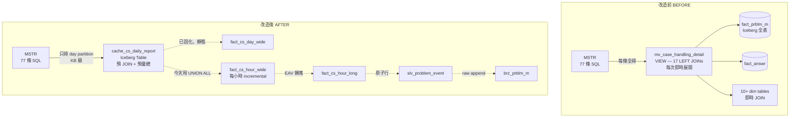

| 指標 | 改造前 | 改造後 |
|---|---|---|
| MSTR SQL 數 | 77 條（不變） | 77 條（不變） |
| 每條掃描量 | GB 級（全表） | KB 級（day partition） |
| 即時 JOIN 計算 | 17 JOIN × 77 次 | 0（已預計算） |
| 比率指標計算 | MSTR 即時 CASE WHEN | Cache 層預計算 |
| 77 群組 flag | MSTR 每條 SQL 內嵌 | Cache 層 entity_sk 維度預計算 |
| 報表延遲 | 常 timeout | < 5 秒（partition 命中） |
| 今日資料 SLA | N/A（全天跑完才有） | 1 小時（UNION ALL intraday） |

---

### E.14 dbt Project 執行順序

```text
dbt build --select
  +brz_prblm_m                   Bronze（append only）
  +slv_problem_event              Silver（merge, 衍生欄位）
  +fact_cs_hour_long              Gold hour EAV（UNPIVOT）
  +fact_cs_hour_wide              Gold hour wide（PIVOT）
  +fact_cs_day_wide               Gold day（SUM by day）
  +fact_cs_month_wide             Gold month（SUM by month）
  +dim_cs_store                   Dim 子站
  +dim_cs_category                Dim 客服分類
  +dim_cs_entity                  Dim entity 解碼
  +cache_cs_daily_report          Cache MV（join dim）
--vars '{"rebuild_from_date": "2025-06-01"}'
```
